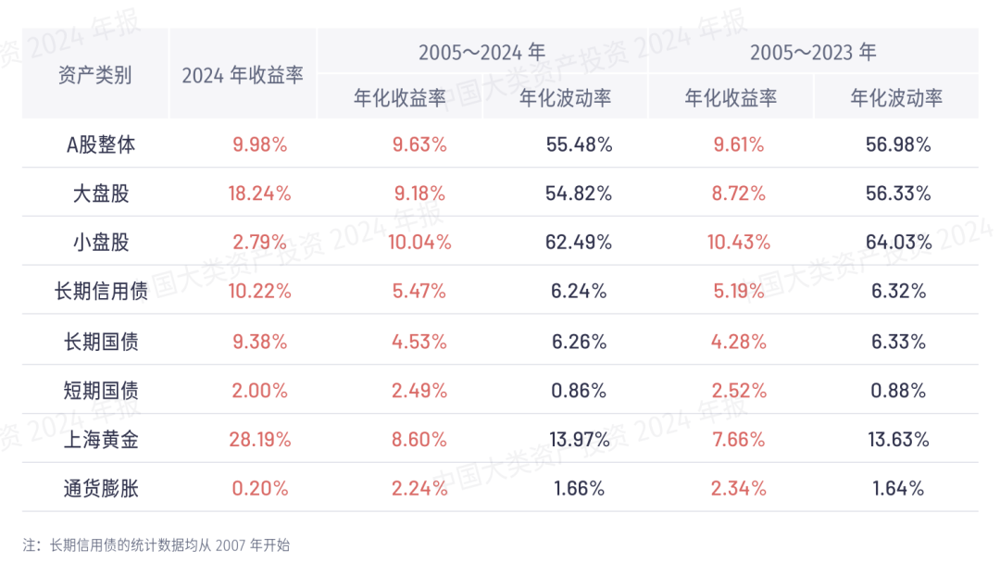
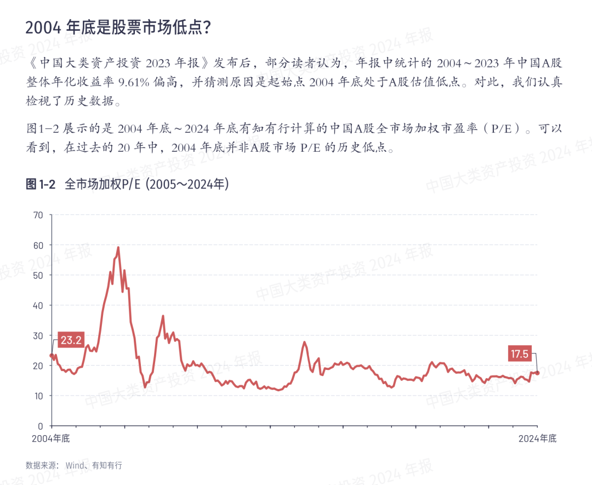
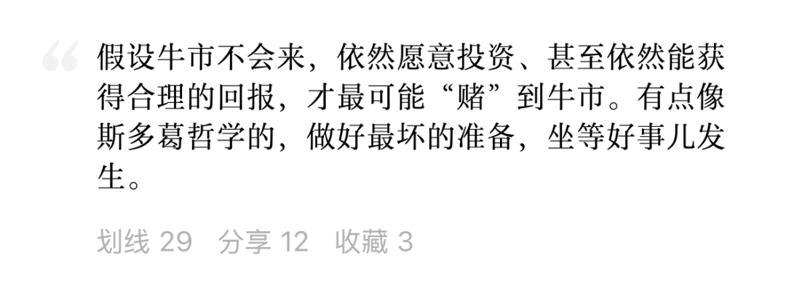
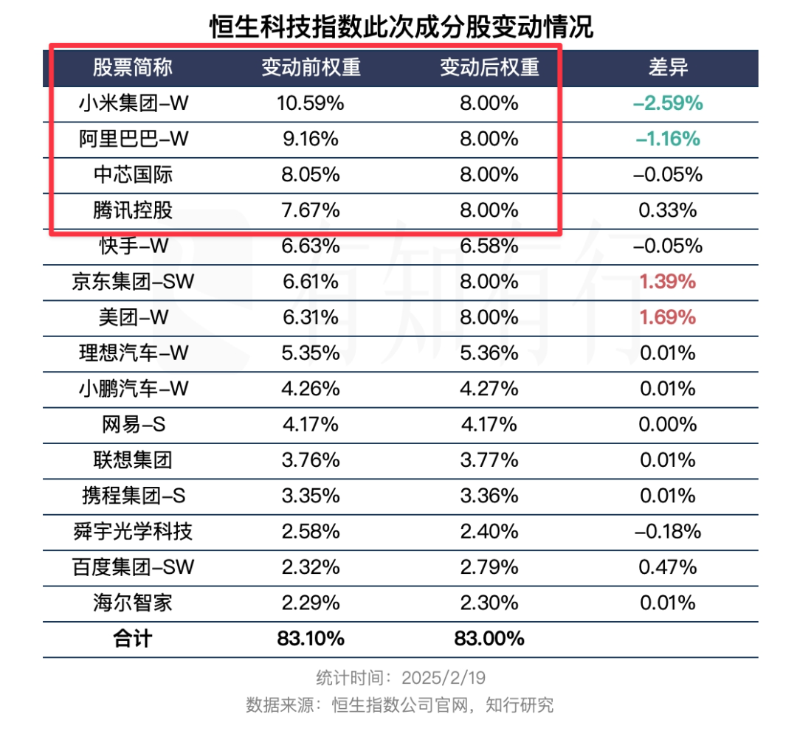
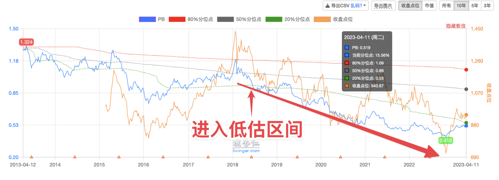

# 踏实

**发布时间**: 2025-03-14 06:30:00

**原文链接**: [http://mp.weixin.qq.com/s?__biz=MzUzNjE3NzQ3Nw==&mid=2247494079&idx=1&sn=21001811fa23fb2e527703e89459670e&chksm=faf89795cd8f1e8393dc57a73039dd7b46217cbb324f3d301e1afd7f4e219219d16325ea705f#rd](http://mp.weixin.qq.com/s?__biz=MzUzNjE3NzQ3Nw==&mid=2247494079&idx=1&sn=21001811fa23fb2e527703e89459670e&chksm=faf89795cd8f1e8393dc57a73039dd7b46217cbb324f3d301e1afd7f4e219219d16325ea705f#rd)

---

昨晚《中国大类资产投资 2024 年报》在有知有行上线了，里面有组数据我看完觉得很踏实。

当我们复盘 A 股的长期收益时——从 2005 年初到 2024 年底，年化 9.63% 👇

常有观点认为 2005 年刚好是 A 股大牛市暴涨几倍的前夕 👇**这个起始时间是不是估值低点，高估了 A 股的真实收益？**

所以今年的资产年报也复盘了从 2004 年底到 2024 年的全市场估值变化 👇

PE 23.2 ➡️ 17.5，当时的估值没有我们以为的那么低，甚至和近十年比还是高估的。年化 9.63%，这是一边消化估值一边得到的结果。

可能也是这个原因，过去 20 年 A 股整体小幅跑输人均 GDP。假如统一起点和终点的估值，只看利润增速和股息（长期投资收益 ≈ 估值变化 + 利润增长 + 股息率），现在大致在这里 👇

股市的长期收益不是来自牛市，而是来自 GDP 增长、经济发展，来自创造财富的公司、人与双手。A 股也是如此。

上次写[牛市不会来](https://mp.weixin.qq.com/s?__biz=MzUzNjE3NzQ3Nw==&mid=2247493983&idx=1&sn=78c8f098df91abb45c6493f001cbd00d&scene=21#wechat_redirect)，文章里大伙划钱最多的段落：

这样不用依赖牛市的估值抬升，从经济发展、公司成长中获得的收益，就是不用赌牛市的收益，也因此更容易得到等到牛市。

很踏实。

……

投资中概时我有过一个困惑（**这个细节大伙不感兴趣也可以跳过，看后面感想部分** ），当时小米市值比腾讯、阿里低很多，即便股价已经涨了 5 倍。但在恒生科技指数里，小米权重却是最高的，超过腾讯阿里。我翻了恒生官网的指数编制规则，是按照流通市值加权，所以更困惑了。

后来终于得到答案 👇

再后来恒生科技更新成分股，果然腾讯、小米、阿里又都变成了 8% 的权重。

很多投资者不会抠这么细，别说查找指数编制规则，可能连指数里有哪些成分股都说不清。以前我也是。

但在这几年熊市里，我越发觉得**只有关注够细、充分了解自己持有的底层资产，才能长久地安心** 。

从把投资当作一段代码，到知道看估值，了解多了一点。但有时候这也不够，就像 2022、2023 年的港股，不管医药、红利还是互联网，都已经到了历史低估区间，结果估值还能再低一半 👇

这张图来自 2023 年的文章，[再买点“还不如存银行”的投资](https://mp.weixin.qq.com/s?__biz=MzUzNjE3NzQ3Nw==&mid=2247491640&idx=1&sn=d0fcdf3506616cb41fffb9aa3c8c6370&chksm=faf89e12cd8f1704c3cd2eee880472d7267d3420ec30fa0516d673fbfa9602d7f45de6cce500&scene=21#wechat_redirect "再买点“还不如存银行”的投资 原创")

后来我把恒生高股息率指数、中国海外互联网指数的成分股名单找出来，一家一家公司读最新财报，看他们都在干什么。没读完，读了有十几家，从银行到基建，从港口到互联网。

看到 PB 0.3、按破产给估值的央企，实际上经营稳定，持续支付股息（因为估值太便宜，股息率一度超过 8%）；看到被质疑应该按照公共事业股（利润稳定但不再增长）给估值的互联网公司，已经普遍恢复正增长，利润涨得更快。我一下就踏实下来了。

当时的生活和投资存在巨大反差，比如：

**在生活中** ，父母在国企央企工作，子女相亲能加分；子女能进国企央企工作，父母会高兴。大家觉得它们是好公司，如果有人说这些公司很快倒闭、工资发不出来，大部分人会觉得你要么是葡萄酸、要么是神经病。

**但在股市里** ，大部分投资者只会担心股价会不会更低，股息未来还有没有，股票会不会归零，公司会不会破产。大家给乐观的人创作了这幅漫画 👇 一只恐龙在担心陨石，另一只恐龙说「没关系，价格已经反映了风险，现在是机会！」

看到这张图是在 2024 年 7 月 9 日的雪球

这不是很矛盾吗？现实生活中的企业，和股票市场中的企业，并没有区别。

> 太多人把投资理财当成了一件非常抽象的事情，而忘记了只要我们在做投资，我们就是把钱扔到一个非常真实的、希望用这笔钱创造更多财富的组织里。
> 
> 比如很多人在买 P2P 的时候，只会盯着收益看，觉得这是一个「投入 1 万块能返回 11000 块」的「理财产品」——但世界上并没有一种神奇的机器，把钱扔进去一年之后就能返回 10% 的回报，而只有真实的、创造财富的公司、人与双手。
> 
> ——《投资第一课》

只有清楚自己在买什么，底层资产是什么，自己直接/间接持有的公司在干什么，参与到真实世界里，才能长久地安心，尤其是在逆行的时候。

  * 财务自由：[我的财务自由实证之路](https://mp.weixin.qq.com/s?__biz=MzUzNjE3NzQ3Nw==&mid=2247494017&idx=1&sn=5df7d864bb1906c86aa06a059e69478d&scene=21#wechat_redirect)

  * 投资笔记：[十年之约](https://mp.weixin.qq.com/s?__biz=MzUzNjE3NzQ3Nw==&mid=2247494007&idx=1&sn=bf8ea39e7ccbba2b92e7fdaf26bf0843&scene=21#wechat_redirect)[‍](https://mp.weixin.qq.com/s?__biz=MzUzNjE3NzQ3Nw==&mid=2247494007&idx=1&sn=bf8ea39e7ccbba2b92e7fdaf26bf0843&scene=21#wechat_redirect)[‍](https://mp.weixin.qq.com/s?__biz=MzUzNjE3NzQ3Nw==&mid=2247494007&idx=1&sn=bf8ea39e7ccbba2b92e7fdaf26bf0843&scene=21#wechat_redirect)[‍](https://mp.weixin.qq.com/s?__biz=MzUzNjE3NzQ3Nw==&mid=2247494007&idx=1&sn=bf8ea39e7ccbba2b92e7fdaf26bf0843&scene=21#wechat_redirect)[‍](https://mp.weixin.qq.com/s?__biz=MzUzNjE3NzQ3Nw==&mid=2247494007&idx=1&sn=bf8ea39e7ccbba2b92e7fdaf26bf0843&scene=21#wechat_redirect)[‍](https://mp.weixin.qq.com/s?__biz=MzUzNjE3NzQ3Nw==&mid=2247494007&idx=1&sn=bf8ea39e7ccbba2b92e7fdaf26bf0843&scene=21#wechat_redirect)

  * 抵御风险：[2 月保险最推荐](https://mp.weixin.qq.com/s?__biz=MzUzNjE3NzQ3Nw==&mid=2247493998&idx=1&sn=d4c2819f79de200cb485b90decb1785e&scene=21#wechat_redirect)[‍](https://mp.weixin.qq.com/s?__biz=MzUzNjE3NzQ3Nw==&mid=2247493998&idx=1&sn=d4c2819f79de200cb485b90decb1785e&scene=21#wechat_redirect)[‍](https://mp.weixin.qq.com/s?__biz=MzUzNjE3NzQ3Nw==&mid=2247493998&idx=1&sn=d4c2819f79de200cb485b90decb1785e&scene=21#wechat_redirect)[‍](https://mp.weixin.qq.com/s?__biz=MzUzNjE3NzQ3Nw==&mid=2247493998&idx=1&sn=d4c2819f79de200cb485b90decb1785e&scene=21#wechat_redirect)[‍](https://mp.weixin.qq.com/s?__biz=MzUzNjE3NzQ3Nw==&mid=2247493998&idx=1&sn=d4c2819f79de200cb485b90decb1785e&scene=21#wechat_redirect)[‍](https://mp.weixin.qq.com/s?__biz=MzUzNjE3NzQ3Nw==&mid=2247493998&idx=1&sn=d4c2819f79de200cb485b90decb1785e&scene=21#wechat_redirect)[‍](https://mp.weixin.qq.com/s?__biz=MzUzNjE3NzQ3Nw==&mid=2247493998&idx=1&sn=d4c2819f79de200cb485b90decb1785e&scene=21#wechat_redirect)[‍](https://mp.weixin.qq.com/s?__biz=MzUzNjE3NzQ3Nw==&mid=2247493998&idx=1&sn=d4c2819f79de200cb485b90decb1785e&scene=21#wechat_redirect)[‍](https://mp.weixin.qq.com/s?__biz=MzUzNjE3NzQ3Nw==&mid=2247493998&idx=1&sn=d4c2819f79de200cb485b90decb1785e&scene=21#wechat_redirect)[‍](https://mp.weixin.qq.com/s?__biz=MzUzNjE3NzQ3Nw==&mid=2247493998&idx=1&sn=d4c2819f79de200cb485b90decb1785e&scene=21#wechat_redirect)[‍](https://mp.weixin.qq.com/s?__biz=MzUzNjE3NzQ3Nw==&mid=2247493998&idx=1&sn=d4c2819f79de200cb485b90decb1785e&scene=21#wechat_redirect)[‍](https://mp.weixin.qq.com/s?__biz=MzUzNjE3NzQ3Nw==&mid=2247493998&idx=1&sn=d4c2819f79de200cb485b90decb1785e&scene=21#wechat_redirect)[‍](https://mp.weixin.qq.com/s?__biz=MzUzNjE3NzQ3Nw==&mid=2247493998&idx=1&sn=d4c2819f79de200cb485b90decb1785e&scene=21#wechat_redirect)[‍](https://mp.weixin.qq.com/s?__biz=MzUzNjE3NzQ3Nw==&mid=2247493998&idx=1&sn=d4c2819f79de200cb485b90decb1785e&scene=21#wechat_redirect)[‍](https://mp.weixin.qq.com/s?__biz=MzUzNjE3NzQ3Nw==&mid=2247493998&idx=1&sn=d4c2819f79de200cb485b90decb1785e&scene=21#wechat_redirect)[‍](https://mp.weixin.qq.com/s?__biz=MzUzNjE3NzQ3Nw==&mid=2247493998&idx=1&sn=d4c2819f79de200cb485b90decb1785e&scene=21#wechat_redirect)[‍](https://mp.weixin.qq.com/s?__biz=MzUzNjE3NzQ3Nw==&mid=2247493998&idx=1&sn=d4c2819f79de200cb485b90decb1785e&scene=21#wechat_redirect)[‍](https://mp.weixin.qq.com/s?__biz=MzUzNjE3NzQ3Nw==&mid=2247493998&idx=1&sn=d4c2819f79de200cb485b90decb1785e&scene=21#wechat_redirect)[‍](https://mp.weixin.qq.com/s?__biz=MzUzNjE3NzQ3Nw==&mid=2247493998&idx=1&sn=d4c2819f79de200cb485b90decb1785e&scene=21#wechat_redirect)[‍](https://mp.weixin.qq.com/s?__biz=MzUzNjE3NzQ3Nw==&mid=2247493998&idx=1&sn=d4c2819f79de200cb485b90decb1785e&scene=21#wechat_redirect)[‍](https://mp.weixin.qq.com/s?__biz=MzUzNjE3NzQ3Nw==&mid=2247493998&idx=1&sn=d4c2819f79de200cb485b90decb1785e&scene=21#wechat_redirect)‍

  * 干货汇总：[财务自由路上应该了解的每一个问题](http://mp.weixin.qq.com/s?__biz=MzUzNjE3NzQ3Nw==&mid=2247489926&idx=1&sn=eac357cebcbfd7250828cdda88d9f122&chksm=fafb67accd8ceebaa1e750f129714bb000be9720a990a70c6fba6fc52fd3712014a58d699d6e&scene=21#wechat_redirect)