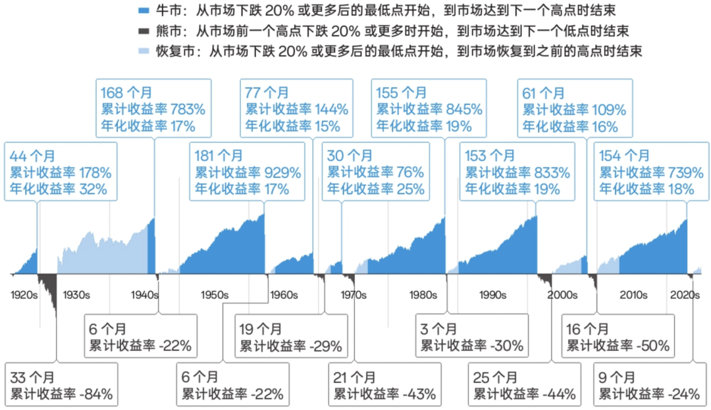

# 该为财务自由准备多少年备用金？

**发布时间**: 2025-04-15 07:30:00

**原文链接**: [http://mp.weixin.qq.com/s?__biz=MzUzNjE3NzQ3Nw==&mid=2247494158&idx=1&sn=cb76cd55425afe7895cfd19db92c0323&chksm=faf89424cd8f1d32b259dfaf94792869b8cb70e41ef31717c6afd4df539a7604f1f9693e735c#rd](http://mp.weixin.qq.com/s?__biz=MzUzNjE3NzQ3Nw==&mid=2247494158&idx=1&sn=cb76cd55425afe7895cfd19db92c0323&chksm=faf89424cd8f1d32b259dfaf94792869b8cb70e41ef31717c6afd4df539a7604f1f9693e735c#rd)

---

最近几年我发现很多伙伴都有个变化——**对现金和备用金的接受度变高了** ——包括我自己。

以前是现金烫手，现在是留钱备用。

以前是有钱就买房，现在是“变现一套房子，手握现金感觉太爽了”。

以前对财务自由计划，我觉得留够 3 年备用金已经不少了。而投资最糟的那段时间，我开始觉得 5～7 年也不是不可以……

偶然得知一个趣闻，「手有余粮」是有知有行去年最受欢迎的限定徽章 👇 

……

从财务自由计划起，一直被大伙问「投资下跌的时候怎么办？怎么能获得稳定的现金流？」

我在这篇分享过比较系统的想法，[如何通过投资获得稳定的现金流](https://mp.weixin.qq.com/s?__biz=MzUzNjE3NzQ3Nw==&mid=2247492671&idx=1&sn=333f7d55055dec260583fd6a7b3bc2de&scene=21#wechat_redirect)。简而言之这么几个原则：

  1. 「丰年」的收益是「歉年」的安全垫，度过投资下跌年份的第一步，是在下跌之前的上涨中吃饱；
  2. 分散投资降低波动，东边不亮西边亮；
  3. 学习农业看天吃饭的方法，建立蓄水池，也就是备用金；
  4. 准备好 Plan B。

今天再展开聊聊备用金，分享几个实践后的经验。

### 一、准备多少备用金？有几个经验公式

不管有没有财务自由计划，都建议留有 6～12 个月无收入生活的备用金。

如果有财务自由计划，可以把时间延长到 3 年，这是比较主流的做法。

也有更久的建议，比如 5～7 年，来自罗宾斯的《不可撼动的财务自由》。理由是（美股）一轮周期底部可能长达 5～7 年，这样最保险。

### 二、备用金消耗不到一半时，心态比较平稳。一旦超过一半就会显著焦虑。

准备了 3 年备用金，如果过了 2 年还看不到改善的希望，人可能就开始慌了。而且投资上越临近黎明越黑暗，像 2024 年 9 月之前，大家情绪越来越差，完全看不到上涨的希望。如果此时备用金临近用完，压力可想而知。

所以最好按照我们能预料的比较糟的情况 2 倍时间来做准备。

其实美股 3～7 年备用金的经验，基本也是过往下跌时长的 2 倍 👇 

配图来自《投资中，我相信的事》，下同。数据基于标普 500 指数

那 A 股的情况如何呢？不太乐观 👇 A 股牛短熊长太明显了…

数据基于沪深 300

如果完全套用 2 倍经验，可能会发现自己要准备长达 10 年的备用金 😂 所以就有了接下来的第三个经验。

### 三、每种方法都会边际收益递减，不要一个思路死磕。

  * 从 0 存款到 6～12 个月备用金，会很有安全感；
  * 从 12 个月变成 3 年，可能就有了说不的勇气；
  * 从 3 年变成 10 年呢？改善就不那么明显了，甚至成了一种负担（类似“没个小目标别想自由”）

只考虑下跌时间忽视了美股和 A 股的不同。在美股标普 500 是一笔 90 分投资（五年跑赢 90% 的基金经理），可以代表了普通人获得投资收益的上限。但在 A 股沪深 300 只能算 50 分投资（五年为期常常一半的基金经理可以跑赢）。

而且也忽略了「那我不买 A 股，直接买美股好了」这样的选项。倒不是建议大家这么做，如果计划长期在国内生活，还是适合主要锚定中国资产。想说的是，考虑问题不能只局限一个视角，**一种方法常常从 0 到 80 收益很高，从 80 到 100 改善有限，而且成本巨大** 。

所以我们也要考虑让「最坏情况」别那么坏。

比如上轮熊市沪深 300 下跌持续 42 个月，幅度达到 45%。但同样是投资指数，均衡低估分散的买法，下跌时间能缩短到 36 个月 ，幅度更是不到 20%（结合后面谈到的备用金支取策略，3 年的备用金此时才用一半）

这里我参考的样板是黑板报第一期（长钱账户的前身）

如果同时分散投资了 A 股和美股，幅度会更小，时间也更短。

……

对了，这里也说说为什么我觉得**计划长期在中国生活，不适合全买美股** 。

很多人觉得股票很“虚”，我用房子来举例吧。假如你的目标是存钱买房，现在给你个机会，买房以前可以让自己的存款和房价同步涨跌，你会选所在城市的房价，还是选美国的房价呢？（当然也可以都不选）

我会优先考虑所在城市的房价，因为这和我存钱买房的目标最一致。哪怕所在城市房价跌了，美国房价涨了，虽然少赚一些，我依然能实现目标。但如果所在城市房价大涨，美国房价下跌，锚定美国房价可能就买不起房了，会非常痛苦。

投资最终要获取的不是钱，而是换成自己所需的资源、解决生活的问题。除非所在国家是个经济不稳定的小国，锚定计划长期生活地区的资产，往往最符合这个目标。

……

好了，说回备用金。

在 A 股投资，准备备用金是一方面，另一方面优化投资、尤其是应对熊市下跌，也很重要。**先做到 80 分的投资，美股 3～7 年备用金的经验，我觉得在 A 股就也可行。具体选多少量力而行。**

考虑备用金时我们考虑的其实是，如何遇到困难时更从容，[如何增加生活的安全边际](https://mp.weixin.qq.com/s?__biz=MzUzNjE3NzQ3Nw==&mid=2247492535&idx=1&sn=e59820c2d8269cd09bcd3095fc227565&scene=21#wechat_redirect)？

所以答案并不局限于备用金，分散投资、预期管理、保险保障、多元化的收入，这些方法都可以用起来。选两三个方法做到 80 分，好过一个方法死磕到 100，成分可能也更低。

不过投资变得均衡分散后，我又遇到了一个问题。以前是市场低估时动用备用金，现在分散投资，各笔投资可能不会同时低估、高估，怎么办？

### 四、以总投资的回撤幅度来决定是否使用备用金。

之前看到一个方法不错，我也学过来了。

假设财务自由后只靠投资生活：

  1. 投资从前期高点回撤超过 10%，动用一半备用金。即每个月的开销一半来自投资变现、一半来自备用金；
  2. 回撤超过 20%，停止变现投资，完全使用备用金生活；
  3. 投资新高以后，恢复变现投资生活，同时变现投资补足前面支取的备用金（相当于之前生活用的都是新高之后的投资）。

如果同期还有收入，也可以是这样：

  1. 投资从前期高点回撤超过 10%，每个月的开销一半来自收入、一半来自备用金，余下用来投资；
  2. 回撤超过 20%，完全使用备用金生活，收入用来加仓（或者收入用来生活，备用金用来加仓，一样的）；
  3. 新高以后，补足备用金。

有时候投资回撤不到 10%，但还是“亏了”，不少小伙伴很介意卖出亏钱的投资。我现在比较能克服这种心态了，有几种视角可以帮到自己：

  * 虽然我亏了 5%，但我想买的投资同期亏了 10%，里外里我还赚了；
  * 我有把握，新投资未来的上涨或者此时变现消费获得的体验，能超过旧投资回本的收益；
  * 物价可以有高有低，投资当然也可以，就当物价涨了；
  * 虽然投资总体回撤，但所有投资里总有个别涨的。把变现当作一次再平衡的机会，可以优先变现多涨/少亏的。

慢慢学会放下买入成本。

以上，一些关于备用金的思考，希望对大家有启发。

  * 财务自由：[我的财务自由实证之路](https://mp.weixin.qq.com/s?__biz=MzUzNjE3NzQ3Nw==&mid=2247494124&idx=1&sn=6a593cdb6129c8dda850c534476a0340&scene=21#wechat_redirect)

  * 投资笔记：[十年之约](https://mp.weixin.qq.com/s?__biz=MzUzNjE3NzQ3Nw==&mid=2247494007&idx=1&sn=bf8ea39e7ccbba2b92e7fdaf26bf0843&scene=21#wechat_redirect)[‍](https://mp.weixin.qq.com/s?__biz=MzUzNjE3NzQ3Nw==&mid=2247494007&idx=1&sn=bf8ea39e7ccbba2b92e7fdaf26bf0843&scene=21#wechat_redirect)[‍](https://mp.weixin.qq.com/s?__biz=MzUzNjE3NzQ3Nw==&mid=2247494007&idx=1&sn=bf8ea39e7ccbba2b92e7fdaf26bf0843&scene=21#wechat_redirect)[‍](https://mp.weixin.qq.com/s?__biz=MzUzNjE3NzQ3Nw==&mid=2247494007&idx=1&sn=bf8ea39e7ccbba2b92e7fdaf26bf0843&scene=21#wechat_redirect)[‍](https://mp.weixin.qq.com/s?__biz=MzUzNjE3NzQ3Nw==&mid=2247494007&idx=1&sn=bf8ea39e7ccbba2b92e7fdaf26bf0843&scene=21#wechat_redirect)[‍](https://mp.weixin.qq.com/s?__biz=MzUzNjE3NzQ3Nw==&mid=2247494007&idx=1&sn=bf8ea39e7ccbba2b92e7fdaf26bf0843&scene=21#wechat_redirect)

  * 抵御风险：[3 月保险最推荐](https://mp.weixin.qq.com/s?__biz=MzUzNjE3NzQ3Nw==&mid=2247494114&idx=1&sn=9972179248d00c20bfc91495b242dc5e&scene=21#wechat_redirect)[‍](https://mp.weixin.qq.com/s?__biz=MzUzNjE3NzQ3Nw==&mid=2247494114&idx=1&sn=9972179248d00c20bfc91495b242dc5e&scene=21#wechat_redirect)[‍](https://mp.weixin.qq.com/s?__biz=MzUzNjE3NzQ3Nw==&mid=2247494114&idx=1&sn=9972179248d00c20bfc91495b242dc5e&scene=21#wechat_redirect)[‍](https://mp.weixin.qq.com/s?__biz=MzUzNjE3NzQ3Nw==&mid=2247494114&idx=1&sn=9972179248d00c20bfc91495b242dc5e&scene=21#wechat_redirect)[‍](https://mp.weixin.qq.com/s?__biz=MzUzNjE3NzQ3Nw==&mid=2247494114&idx=1&sn=9972179248d00c20bfc91495b242dc5e&scene=21#wechat_redirect)[‍](https://mp.weixin.qq.com/s?__biz=MzUzNjE3NzQ3Nw==&mid=2247494114&idx=1&sn=9972179248d00c20bfc91495b242dc5e&scene=21#wechat_redirect)[‍](https://mp.weixin.qq.com/s?__biz=MzUzNjE3NzQ3Nw==&mid=2247494114&idx=1&sn=9972179248d00c20bfc91495b242dc5e&scene=21#wechat_redirect)[‍](https://mp.weixin.qq.com/s?__biz=MzUzNjE3NzQ3Nw==&mid=2247494114&idx=1&sn=9972179248d00c20bfc91495b242dc5e&scene=21#wechat_redirect)[‍](https://mp.weixin.qq.com/s?__biz=MzUzNjE3NzQ3Nw==&mid=2247494114&idx=1&sn=9972179248d00c20bfc91495b242dc5e&scene=21#wechat_redirect)[‍](https://mp.weixin.qq.com/s?__biz=MzUzNjE3NzQ3Nw==&mid=2247494114&idx=1&sn=9972179248d00c20bfc91495b242dc5e&scene=21#wechat_redirect)[‍](https://mp.weixin.qq.com/s?__biz=MzUzNjE3NzQ3Nw==&mid=2247494114&idx=1&sn=9972179248d00c20bfc91495b242dc5e&scene=21#wechat_redirect)[‍](https://mp.weixin.qq.com/s?__biz=MzUzNjE3NzQ3Nw==&mid=2247494114&idx=1&sn=9972179248d00c20bfc91495b242dc5e&scene=21#wechat_redirect)[‍](https://mp.weixin.qq.com/s?__biz=MzUzNjE3NzQ3Nw==&mid=2247494114&idx=1&sn=9972179248d00c20bfc91495b242dc5e&scene=21#wechat_redirect)[‍](https://mp.weixin.qq.com/s?__biz=MzUzNjE3NzQ3Nw==&mid=2247494114&idx=1&sn=9972179248d00c20bfc91495b242dc5e&scene=21#wechat_redirect)[‍](https://mp.weixin.qq.com/s?__biz=MzUzNjE3NzQ3Nw==&mid=2247494114&idx=1&sn=9972179248d00c20bfc91495b242dc5e&scene=21#wechat_redirect)[‍](https://mp.weixin.qq.com/s?__biz=MzUzNjE3NzQ3Nw==&mid=2247494114&idx=1&sn=9972179248d00c20bfc91495b242dc5e&scene=21#wechat_redirect)[‍](https://mp.weixin.qq.com/s?__biz=MzUzNjE3NzQ3Nw==&mid=2247494114&idx=1&sn=9972179248d00c20bfc91495b242dc5e&scene=21#wechat_redirect)[‍](https://mp.weixin.qq.com/s?__biz=MzUzNjE3NzQ3Nw==&mid=2247494114&idx=1&sn=9972179248d00c20bfc91495b242dc5e&scene=21#wechat_redirect)[‍](https://mp.weixin.qq.com/s?__biz=MzUzNjE3NzQ3Nw==&mid=2247494114&idx=1&sn=9972179248d00c20bfc91495b242dc5e&scene=21#wechat_redirect)[‍](https://mp.weixin.qq.com/s?__biz=MzUzNjE3NzQ3Nw==&mid=2247494114&idx=1&sn=9972179248d00c20bfc91495b242dc5e&scene=21#wechat_redirect)[‍](https://mp.weixin.qq.com/s?__biz=MzUzNjE3NzQ3Nw==&mid=2247494114&idx=1&sn=9972179248d00c20bfc91495b242dc5e&scene=21#wechat_redirect)‍

  * 干货汇总：[财务自由路上应该了解的每一个问题](http://mp.weixin.qq.com/s?__biz=MzUzNjE3NzQ3Nw==&mid=2247489926&idx=1&sn=eac357cebcbfd7250828cdda88d9f122&chksm=fafb67accd8ceebaa1e750f129714bb000be9720a990a70c6fba6fc52fd3712014a58d699d6e&scene=21#wechat_redirect)