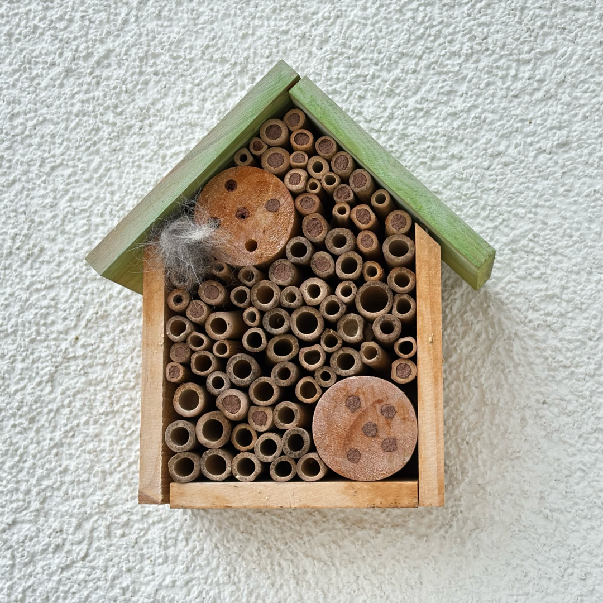

# 生活简单，内心富足

**发布时间**: 2025-04-25 07:30:00

**原文链接**: [http://mp.weixin.qq.com/s?__biz=MzUzNjE3NzQ3Nw==&mid=2247494194&idx=1&sn=ba671823919a0dadb205d3824c27dff3&chksm=faf89418cd8f1d0e76459a0409d37a00a07cb558e32098d0a8dafb6e6d89df7647d80ee1056d#rd](http://mp.weixin.qq.com/s?__biz=MzUzNjE3NzQ3Nw==&mid=2247494194&idx=1&sn=ba671823919a0dadb205d3824c27dff3&chksm=faf89418cd8f1d0e76459a0409d37a00a07cb558e32098d0a8dafb6e6d89df7647d80ee1056d#rd)

---

聊个最近对生活有些触动的小事儿。

我们家附近常看到一只澳牧，主人遛狗时手上拿个夹子，在路边草丛进进出出捡垃圾。

德国人工很贵，环卫都是开着清扫车走一圈，干活不会这么仔细、还下来亲自捡，草丛里的垃圾经常会待很久很久。所以一段时间我们都很好奇他们家是做什么的，但不巧钱钱和这只澳牧不对付，离老远就开骂，骂得很脏，也没机会见面闲聊。

后来偶然从另一只拉布拉多主人那得知，他们一家夫妻俩**都是医生。遛狗路上顺便捡捡垃圾** ，为环保做点事儿。拉布拉多主人说，自己也在考虑捡。

后来又聊到狗子怕小孩，她说在考虑「治疗犬」考试，发现周围有 20 个小孩时狗子会很紧张，陪伴小孩不合适。但陪伴老人时状态很好，老人们都很喜欢，以后也许能带着狗多去陪老人。

一直以为治疗犬都是专业机构在做，没想到普通人自己家的狗也可以。这给我很大启发，原来养狗不光可以自己撸，还能为别人做一些事儿。

聊到这突然想到，和德国同事、邻居聊天时，很少觉得他们有我们这么明显的收入焦虑和成长焦虑。我们喜欢把赚钱和进步（然后赚更多钱、更成功）挂在嘴边，**总在担心自己拥有的不够多。但他们经常在想，自己能不能再多给予一些** （相同收入水平下）。

……

很多刚来德国的小伙伴，头几年都会觉得这里很无聊。商场晚上 8 点就关了，周日、节假日也不营业，街上看不到几个人。

我们先想到的「有聊」常常是购买/获得式的，大多和消费相关。但德国生活中的「有聊」很多是陪伴/给予式的，所以起初不那么容易看到。

开始我们也挺纳闷，一到周末、节假日街上不见人，人都哪去了？后来习惯日常散步，才发现森林和别家后院里的人比平时多了好多倍。

前同事每天往返 100km 上下班，我问他为啥不搬到公司边上住（房价房租差不多）。他说，因为从小在那长大，父母、朋友都在那，不想搬走了。后来发现这样情况还挺常见的。再有讲中国重视家庭、欧美个人主义这样的刻板印象，我会在心里画个问号了。

去年我总在森林里看到一种蛇，就去查有没有毒，得知当地品种均无毒。但印象最深的是介绍页面最后的一段话——建议大家**在园子的角落里多堆几块石头，这些蛇就能有更多栖息机会** ，更容易生存下去。

在自家园子里给蛇留点地方，这给了我不小冲击……不过我也有点能理解这种想法。之前给大伙晒德国常见的[蜜蜂酒店](https://mp.weixin.qq.com/s?__biz=MzUzNjE3NzQ3Nw==&mid=2247492925&idx=1&sn=cd2f8750565f5c5a1173b4e0e43b2fc1&scene=21#wechat_redirect) 👇 

我们家的蜜蜂酒店好像口碑传开了，一年比一年热闹，今年能住满快一半了！左上角的狗毛是给鸟留的，以后会有鸟取走。

很多伙伴第一个问题都是，能吃蜂蜜么？

不能 😂 甚至答案刚好相反。虽然叫蜜蜂酒店，但其实是给不产蜜的野生蜂住的。现在养蜂太多了，饲养蜜蜂挤占了野生蜂的生存空间，这些酒店是留给野生蜂的。

也有点像给予式的快乐。

……

**不是想说哪种生活方式更好、更高级** 。而是我觉得看过、经历过越多不同的生活方式、不同的文化，会越有勇气选择自己想要的生活。

很多告诉你该干什么的声音，背后常有一种恐吓式的叙事「你如果不……以后就废了」

  * 现在不赶紧买房，以后就买不起了；
  * 没有拥有、经历过 XX 体验，人生就不完整；
  * 淋雨了要赶紧喝姜汤，不然就会感冒；
  * XX 岁是孩子的敏感期，不如何如何就会影响一辈子；
  * 现在大牛市人人都赚钱，你不赶紧买就被落下啦；
  * ……

但看到更多生活样本，我会发现许多人没做这些，最后也没「废了」。慢慢就能放下这些恐惧、跳出这种叙事，原来也不是他们说得那么不可或缺嘛。

这样，我就有了更多勇气去选择自己想要的生活。

  * 财务自由：[我的财务自由实证之路](https://mp.weixin.qq.com/s?__biz=MzUzNjE3NzQ3Nw==&mid=2247494124&idx=1&sn=6a593cdb6129c8dda850c534476a0340&scene=21#wechat_redirect)

  * 投资笔记：[十年之约](https://mp.weixin.qq.com/s?__biz=MzUzNjE3NzQ3Nw==&mid=2247494007&idx=1&sn=bf8ea39e7ccbba2b92e7fdaf26bf0843&scene=21#wechat_redirect)[‍](https://mp.weixin.qq.com/s?__biz=MzUzNjE3NzQ3Nw==&mid=2247494007&idx=1&sn=bf8ea39e7ccbba2b92e7fdaf26bf0843&scene=21#wechat_redirect)[‍](https://mp.weixin.qq.com/s?__biz=MzUzNjE3NzQ3Nw==&mid=2247494007&idx=1&sn=bf8ea39e7ccbba2b92e7fdaf26bf0843&scene=21#wechat_redirect)[‍](https://mp.weixin.qq.com/s?__biz=MzUzNjE3NzQ3Nw==&mid=2247494007&idx=1&sn=bf8ea39e7ccbba2b92e7fdaf26bf0843&scene=21#wechat_redirect)[‍](https://mp.weixin.qq.com/s?__biz=MzUzNjE3NzQ3Nw==&mid=2247494007&idx=1&sn=bf8ea39e7ccbba2b92e7fdaf26bf0843&scene=21#wechat_redirect)[‍](https://mp.weixin.qq.com/s?__biz=MzUzNjE3NzQ3Nw==&mid=2247494007&idx=1&sn=bf8ea39e7ccbba2b92e7fdaf26bf0843&scene=21#wechat_redirect)

  * 抵御风险：[4 月保险最推荐](https://mp.weixin.qq.com/s?__biz=MzUzNjE3NzQ3Nw==&mid=2247494178&idx=1&sn=7847c8261d9f648ba99f0906d76b7b71&scene=21#wechat_redirect)[‍](https://mp.weixin.qq.com/s?__biz=MzUzNjE3NzQ3Nw==&mid=2247494178&idx=1&sn=7847c8261d9f648ba99f0906d76b7b71&scene=21#wechat_redirect)[‍](https://mp.weixin.qq.com/s?__biz=MzUzNjE3NzQ3Nw==&mid=2247494178&idx=1&sn=7847c8261d9f648ba99f0906d76b7b71&scene=21#wechat_redirect)[‍](https://mp.weixin.qq.com/s?__biz=MzUzNjE3NzQ3Nw==&mid=2247494178&idx=1&sn=7847c8261d9f648ba99f0906d76b7b71&scene=21#wechat_redirect)[‍](https://mp.weixin.qq.com/s?__biz=MzUzNjE3NzQ3Nw==&mid=2247494178&idx=1&sn=7847c8261d9f648ba99f0906d76b7b71&scene=21#wechat_redirect)[‍](https://mp.weixin.qq.com/s?__biz=MzUzNjE3NzQ3Nw==&mid=2247494178&idx=1&sn=7847c8261d9f648ba99f0906d76b7b71&scene=21#wechat_redirect)[‍](https://mp.weixin.qq.com/s?__biz=MzUzNjE3NzQ3Nw==&mid=2247494178&idx=1&sn=7847c8261d9f648ba99f0906d76b7b71&scene=21#wechat_redirect)[‍](https://mp.weixin.qq.com/s?__biz=MzUzNjE3NzQ3Nw==&mid=2247494178&idx=1&sn=7847c8261d9f648ba99f0906d76b7b71&scene=21#wechat_redirect)[‍](https://mp.weixin.qq.com/s?__biz=MzUzNjE3NzQ3Nw==&mid=2247494178&idx=1&sn=7847c8261d9f648ba99f0906d76b7b71&scene=21#wechat_redirect)[‍](https://mp.weixin.qq.com/s?__biz=MzUzNjE3NzQ3Nw==&mid=2247494178&idx=1&sn=7847c8261d9f648ba99f0906d76b7b71&scene=21#wechat_redirect)[‍](https://mp.weixin.qq.com/s?__biz=MzUzNjE3NzQ3Nw==&mid=2247494178&idx=1&sn=7847c8261d9f648ba99f0906d76b7b71&scene=21#wechat_redirect)[‍](https://mp.weixin.qq.com/s?__biz=MzUzNjE3NzQ3Nw==&mid=2247494178&idx=1&sn=7847c8261d9f648ba99f0906d76b7b71&scene=21#wechat_redirect)[‍](https://mp.weixin.qq.com/s?__biz=MzUzNjE3NzQ3Nw==&mid=2247494178&idx=1&sn=7847c8261d9f648ba99f0906d76b7b71&scene=21#wechat_redirect)[‍](https://mp.weixin.qq.com/s?__biz=MzUzNjE3NzQ3Nw==&mid=2247494178&idx=1&sn=7847c8261d9f648ba99f0906d76b7b71&scene=21#wechat_redirect)[‍](https://mp.weixin.qq.com/s?__biz=MzUzNjE3NzQ3Nw==&mid=2247494178&idx=1&sn=7847c8261d9f648ba99f0906d76b7b71&scene=21#wechat_redirect)[‍](https://mp.weixin.qq.com/s?__biz=MzUzNjE3NzQ3Nw==&mid=2247494178&idx=1&sn=7847c8261d9f648ba99f0906d76b7b71&scene=21#wechat_redirect)[‍](https://mp.weixin.qq.com/s?__biz=MzUzNjE3NzQ3Nw==&mid=2247494178&idx=1&sn=7847c8261d9f648ba99f0906d76b7b71&scene=21#wechat_redirect)[‍](https://mp.weixin.qq.com/s?__biz=MzUzNjE3NzQ3Nw==&mid=2247494178&idx=1&sn=7847c8261d9f648ba99f0906d76b7b71&scene=21#wechat_redirect)[‍](https://mp.weixin.qq.com/s?__biz=MzUzNjE3NzQ3Nw==&mid=2247494178&idx=1&sn=7847c8261d9f648ba99f0906d76b7b71&scene=21#wechat_redirect)[‍](https://mp.weixin.qq.com/s?__biz=MzUzNjE3NzQ3Nw==&mid=2247494178&idx=1&sn=7847c8261d9f648ba99f0906d76b7b71&scene=21#wechat_redirect)[‍](https://mp.weixin.qq.com/s?__biz=MzUzNjE3NzQ3Nw==&mid=2247494178&idx=1&sn=7847c8261d9f648ba99f0906d76b7b71&scene=21#wechat_redirect)‍

  * 干货汇总：[财务自由路上应该了解的每一个问题](http://mp.weixin.qq.com/s?__biz=MzUzNjE3NzQ3Nw==&mid=2247489926&idx=1&sn=eac357cebcbfd7250828cdda88d9f122&chksm=fafb67accd8ceebaa1e750f129714bb000be9720a990a70c6fba6fc52fd3712014a58d699d6e&scene=21#wechat_redirect)