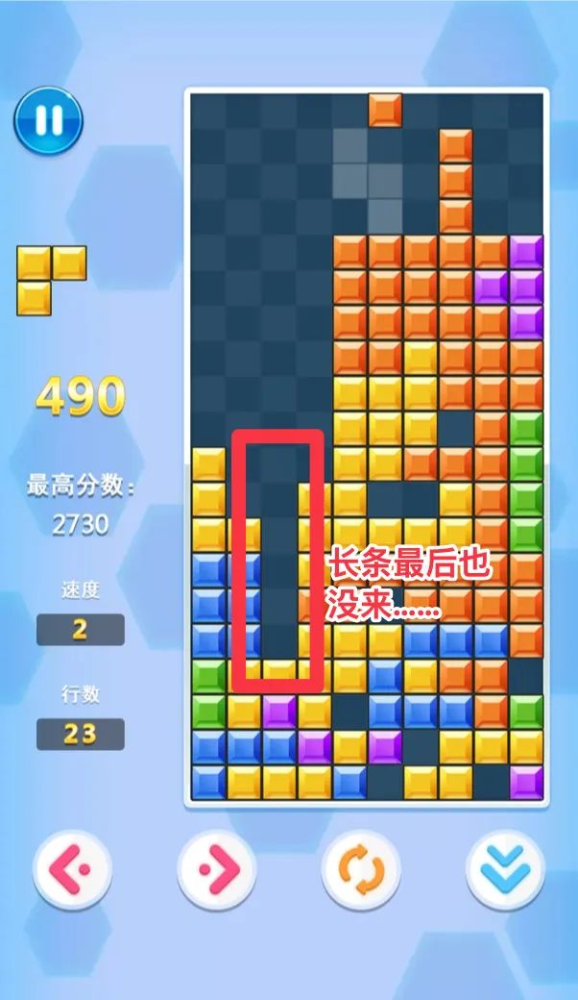

# 当财务自由遇上生病…

**发布时间**: 2025-07-21 07:30:00

**原文链接**: [http://mp.weixin.qq.com/s?__biz=MzUzNjE3NzQ3Nw==&mid=2247494316&idx=1&sn=f0f240fbf510051de9aec59268d12838&chksm=faf89486cd8f1d908b1ac696bcc62a3650c7fcb696a0a9b34b765241eaa2d01647dfa12256e0#rd](http://mp.weixin.qq.com/s?__biz=MzUzNjE3NzQ3Nw==&mid=2247494316&idx=1&sn=f0f240fbf510051de9aec59268d12838&chksm=faf89486cd8f1d908b1ac696bcc62a3650c7fcb696a0a9b34b765241eaa2d01647dfa12256e0#rd)

---

钱钱（我家狗子）病了 😭 最近我和也太是吃不香、睡不好，人都有点恍惚了。大部分心力都在看医生、跑急诊、读科普、记日志…

从嘻嘻哈哈觉得小事儿，到病情严重开始担心，最糟糕时天天活在下一秒就会发病的恐惧里，睡觉听到点儿声音就会从床上弹起来。

再到现在，我可能有点麻了。

突然在想，既然这些已经发生、无法改变，我能不能先试着改变一下自己的心态，不如也想想从中会得到些什么？

想到刚开始规划财务自由时，经常被大伙问到的「万一自由以后遇上生病/意外怎么办？」。好吧，我也成了样本，当做一次观察学习的机会。

挺反直觉的，我们身体健康时想象生病，常会觉得这是一笔额外开销。但实际上，我们家**当月开销比平时还低一些** 。原因也简单，赶上家人生病，是真没心情吃喝、购物 ，原来的每月消费预算贴补医疗开销反而还有些富余。

目前我们的账单：

  * 116 殴，往来医院的路费。有些检查当地兽医做不了，需要去 50km 外的医院，租了两次车；
  * 266 殴，医院挂号和血检；
  * 150 殴，基因检测，确定哪些药不能吃；
  * 140 殴，化学绝育（可逆，6 个月有效，观察看看有没有帮助）
  * 70 殴，药品

大约 750 欧元总共。

不过账单里还有个隐藏大头，看护费。钱钱目前要时刻有人看着，我们俩平时都在家就自己照顾了。如果要请人，或者上班时间送去寄养，开销就不小了。不自由时拿钱买时间，自由以后可以用时间换钱，所以开销也低不少。

目前还没涉及到手术，需要手术的话保险能报销。我们给宠物挑保险也是按照「住院医疗」的思路挑的，门诊自付，手术费无限保额，250 殴免赔额（保费一个月 17 殴）。

所以目前来说，财务规划受医疗影响没有以为的那么大，主要占的还是精力。换到人身上我想也是，考虑到社保、保险更完善，报销比例更高，自付的部分平时消费预算抵一些，自己的时间抵一些，剩下就没多少了。

不过前提是短期大笔医疗开支。如果是持续治疗，用消费开支抵医疗费的就不太行了。人很难一直不消费，越是长期的挑战，越需要在过程中照顾好自己。

……

之前我给财务自由规划的[ 6 层安全边际](https://mp.weixin.qq.com/s?__biz=MzUzNjE3NzQ3Nw==&mid=2247488963&idx=1&sn=da44254227d0ca16f3e7e2f9cc30ef5c&scene=21#wechat_redirect)中的 4、开支弹性，这次有了更直观的体会——**平时花多花少问题不大，但关键时刻要减得下来** 。

日常开销注意区分哪些是固定开支，每个月不能停的；哪些是弹性开支，遇到问题可以临时砍的。

除了开销总额，开支结构也很重要。固定开支占比越低，处理问题的空间才越大。

希望能给担心这类问题的伙伴们一些参考。

也真的很像我以前读过的不少财务自由博主，自由后的生活方方面面都可能出意外，财务反而最稳。

一个很容易忽视的事实是，从客观概率而言，连意外死亡的概率都比财务自由后破产的概率大得多 👇

也可能是因为人人都很担心财务，都会提前准备，才不容易出意外。人人都知道的危机，往往就不再是危机。风险总是藏在我们没注意到的地方。

今年上半年我觉得自己很顺，干啥啥行。当时就在想，不出意外的话该出意外了，管理好预期，生活很难一路顺遂。

果然。

……

所以连带着，我又考虑了一个问题——如何走出困境？

因为一条广告撩拨（故意玩得稀烂，让你觉得自己想上），最近我又重温了俄罗斯方块，突然发现有个游戏技巧特别有启发。

每次玩俄罗斯方块，都是开头很顺，啪啪地消除，直到后面突然来个奇形怪状，从此难度陡增。好几次我气得遇到这种就重开一局。

但后来我突然想到，能不能放下这些失误或是厄运，在现有基础上尽快搭出一个新平面 👇 然后**假装自己是新的一局，毕竟每次开头都很顺**

结果真的，学会放下，搭出新平面“重开”。顿时各种方块就都能找到合适的位置了，很快把下面的空隙也逐步消除 👇 最终恢复如初

总想着以前的错误，想着一把全消掉，经常到死也没等来“长条” 👇 我一度觉得算法很恶意，就给长条形状很小的概率，越玩越气  （假装重开后感觉反转了，长条原来给这么多！）

想明白这个关键，我的平均分立马从 300 多稳定到了 1000 以上。

感觉投资和生活也是，总想着弥补过去的错误，翻盘过去的厄运，结果一步错步步错。一边想着以前的错误，一边面对现在的问题，一味等着某个“方块”，最后路越走越窄。错误也有复利效应。

这让我想到一句话，**规律作息、吃得健康、保持运动、足够睡眠，几乎可以带人走出任何困境** 。

> 我有许多焦虑的来访者在按时睡觉和吃早餐之后都恢复到了正常状态。
> 
> ——《人生十二法则》

尽快搭出一个新的平面，假装重来。

PS：后来我才知道，现在俄罗斯方块小程序可以看广告换长条了。这也能成致富密码 🤣

  * 财务自由：[我的财务自由实证之路](https://mp.weixin.qq.com/s?__biz=MzUzNjE3NzQ3Nw==&mid=2247494304&idx=1&sn=a2251bc74e59053b832ed80560f73e21&scene=21#wechat_redirect)

  * 投资笔记：[十年之约](https://mp.weixin.qq.com/s?__biz=MzUzNjE3NzQ3Nw==&mid=2247494286&idx=1&sn=92cc87c5946362bbc3cc7d1f61573667&scene=21#wechat_redirect)[‍](https://mp.weixin.qq.com/s?__biz=MzUzNjE3NzQ3Nw==&mid=2247494286&idx=1&sn=92cc87c5946362bbc3cc7d1f61573667&scene=21#wechat_redirect)[‍](https://mp.weixin.qq.com/s?__biz=MzUzNjE3NzQ3Nw==&mid=2247494286&idx=1&sn=92cc87c5946362bbc3cc7d1f61573667&scene=21#wechat_redirect)[‍](https://mp.weixin.qq.com/s?__biz=MzUzNjE3NzQ3Nw==&mid=2247494286&idx=1&sn=92cc87c5946362bbc3cc7d1f61573667&scene=21#wechat_redirect)[‍](https://mp.weixin.qq.com/s?__biz=MzUzNjE3NzQ3Nw==&mid=2247494286&idx=1&sn=92cc87c5946362bbc3cc7d1f61573667&scene=21#wechat_redirect)[‍](https://mp.weixin.qq.com/s?__biz=MzUzNjE3NzQ3Nw==&mid=2247494286&idx=1&sn=92cc87c5946362bbc3cc7d1f61573667&scene=21#wechat_redirect)

  * 抵御风险：[6 月保险最推荐](https://mp.weixin.qq.com/s?__biz=MzUzNjE3NzQ3Nw==&mid=2247494279&idx=1&sn=5f9358248838ed5aa1528025623ca77d&scene=21#wechat_redirect)[‍](https://mp.weixin.qq.com/s?__biz=MzUzNjE3NzQ3Nw==&mid=2247494279&idx=1&sn=5f9358248838ed5aa1528025623ca77d&scene=21#wechat_redirect)[‍](https://mp.weixin.qq.com/s?__biz=MzUzNjE3NzQ3Nw==&mid=2247494279&idx=1&sn=5f9358248838ed5aa1528025623ca77d&scene=21#wechat_redirect)[‍](https://mp.weixin.qq.com/s?__biz=MzUzNjE3NzQ3Nw==&mid=2247494279&idx=1&sn=5f9358248838ed5aa1528025623ca77d&scene=21#wechat_redirect)[‍](https://mp.weixin.qq.com/s?__biz=MzUzNjE3NzQ3Nw==&mid=2247494279&idx=1&sn=5f9358248838ed5aa1528025623ca77d&scene=21#wechat_redirect)[‍](https://mp.weixin.qq.com/s?__biz=MzUzNjE3NzQ3Nw==&mid=2247494279&idx=1&sn=5f9358248838ed5aa1528025623ca77d&scene=21#wechat_redirect)[‍](https://mp.weixin.qq.com/s?__biz=MzUzNjE3NzQ3Nw==&mid=2247494279&idx=1&sn=5f9358248838ed5aa1528025623ca77d&scene=21#wechat_redirect)[‍](https://mp.weixin.qq.com/s?__biz=MzUzNjE3NzQ3Nw==&mid=2247494279&idx=1&sn=5f9358248838ed5aa1528025623ca77d&scene=21#wechat_redirect)[‍](https://mp.weixin.qq.com/s?__biz=MzUzNjE3NzQ3Nw==&mid=2247494279&idx=1&sn=5f9358248838ed5aa1528025623ca77d&scene=21#wechat_redirect)[‍](https://mp.weixin.qq.com/s?__biz=MzUzNjE3NzQ3Nw==&mid=2247494279&idx=1&sn=5f9358248838ed5aa1528025623ca77d&scene=21#wechat_redirect)[‍](https://mp.weixin.qq.com/s?__biz=MzUzNjE3NzQ3Nw==&mid=2247494279&idx=1&sn=5f9358248838ed5aa1528025623ca77d&scene=21#wechat_redirect)[‍](https://mp.weixin.qq.com/s?__biz=MzUzNjE3NzQ3Nw==&mid=2247494279&idx=1&sn=5f9358248838ed5aa1528025623ca77d&scene=21#wechat_redirect)[‍](https://mp.weixin.qq.com/s?__biz=MzUzNjE3NzQ3Nw==&mid=2247494279&idx=1&sn=5f9358248838ed5aa1528025623ca77d&scene=21#wechat_redirect)[‍](https://mp.weixin.qq.com/s?__biz=MzUzNjE3NzQ3Nw==&mid=2247494279&idx=1&sn=5f9358248838ed5aa1528025623ca77d&scene=21#wechat_redirect)[‍](https://mp.weixin.qq.com/s?__biz=MzUzNjE3NzQ3Nw==&mid=2247494279&idx=1&sn=5f9358248838ed5aa1528025623ca77d&scene=21#wechat_redirect)[‍](https://mp.weixin.qq.com/s?__biz=MzUzNjE3NzQ3Nw==&mid=2247494279&idx=1&sn=5f9358248838ed5aa1528025623ca77d&scene=21#wechat_redirect)[‍](https://mp.weixin.qq.com/s?__biz=MzUzNjE3NzQ3Nw==&mid=2247494279&idx=1&sn=5f9358248838ed5aa1528025623ca77d&scene=21#wechat_redirect)[‍](https://mp.weixin.qq.com/s?__biz=MzUzNjE3NzQ3Nw==&mid=2247494279&idx=1&sn=5f9358248838ed5aa1528025623ca77d&scene=21#wechat_redirect)[‍](https://mp.weixin.qq.com/s?__biz=MzUzNjE3NzQ3Nw==&mid=2247494279&idx=1&sn=5f9358248838ed5aa1528025623ca77d&scene=21#wechat_redirect)[‍](https://mp.weixin.qq.com/s?__biz=MzUzNjE3NzQ3Nw==&mid=2247494279&idx=1&sn=5f9358248838ed5aa1528025623ca77d&scene=21#wechat_redirect)[‍](https://mp.weixin.qq.com/s?__biz=MzUzNjE3NzQ3Nw==&mid=2247494279&idx=1&sn=5f9358248838ed5aa1528025623ca77d&scene=21#wechat_redirect)‍

  * 干货汇总：[财务自由路上应该了解的每一个问题](http://mp.weixin.qq.com/s?__biz=MzUzNjE3NzQ3Nw==&mid=2247489926&idx=1&sn=eac357cebcbfd7250828cdda88d9f122&chksm=fafb67accd8ceebaa1e750f129714bb000be9720a990a70c6fba6fc52fd3712014a58d699d6e&scene=21#wechat_redirect)