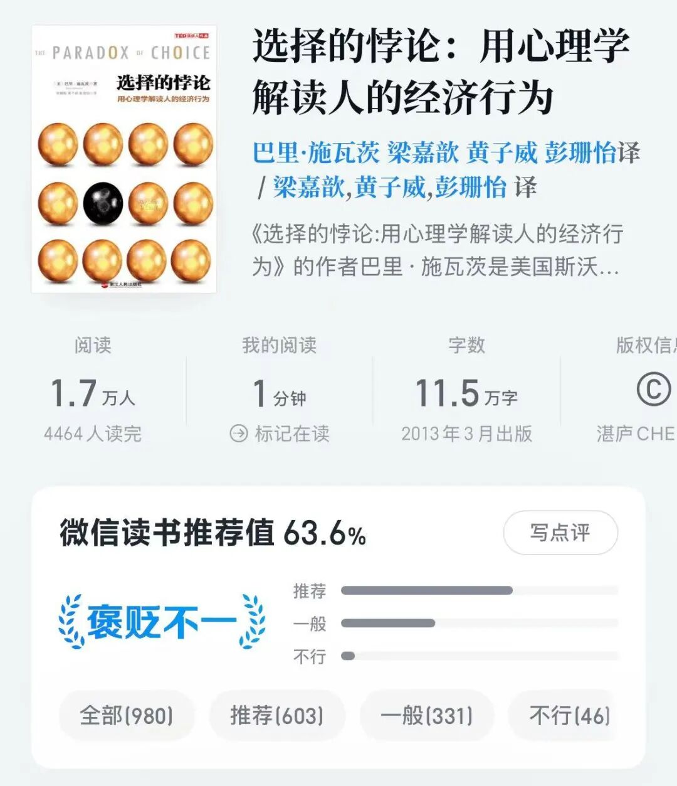
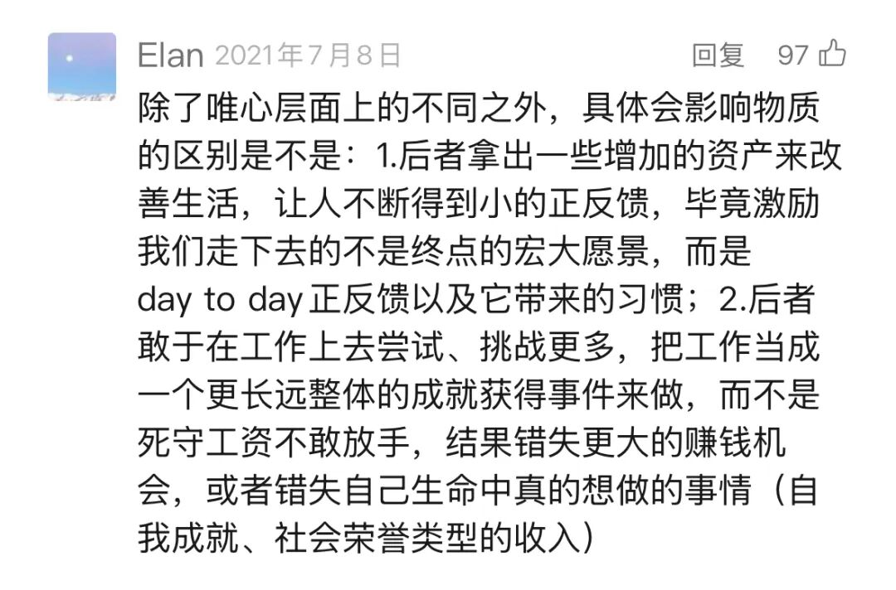

# 牛市生活指南

**发布时间**: 2025-08-15 07:30:00

**原文链接**: [http://mp.weixin.qq.com/s?__biz=MzUzNjE3NzQ3Nw==&mid=2247494374&idx=1&sn=83ba519460cc81d9b3505f00cfcb6dd7&chksm=faf894cccd8f1ddaa8846a9ad2f4143eb9357c8d92677acacd1af196d3a3d285aa88f8b4073c#rd](http://mp.weixin.qq.com/s?__biz=MzUzNjE3NzQ3Nw==&mid=2247494374&idx=1&sn=83ba519460cc81d9b3505f00cfcb6dd7&chksm=faf894cccd8f1ddaa8846a9ad2f4143eb9357c8d92677acacd1af196d3a3d285aa88f8b4073c#rd)

---

最近我和也太突然意识到，原来牛市里花钱可以比熊市更纠结，有点选择过载了……前两年虽然市场不好，但我们过得挺开心。当时就在畅想如果未来行情好了，那得开心到什么程度。但，这件事儿好像没有自动发生。

于是我去找 AI 讨论这个疑惑，得到的回答有理有据，给大伙摘录一部分👇

「选择变多不一定带来幸福」，钱少有钱少的活法，钱多有钱多的烦恼（看到这句想读《选择的悖论》了，微信读书里有）

但如果这么纠结，咱们那能不能干脆退回熊市心态，继续保守呢？感觉也不行。

因为**如果牛市不花钱，以后容易怀疑投资对生活的意义** 。就像上轮熊市也太最遗憾的事儿「牛市钱没花着，熊市苦没少吃」，投资到底图啥？当时我就下决心，这轮一定得让她花到，变成一些能看见的改善。

牛市里适当变现投资、改善生活，不仅是关注当下，也是增援未来。

### 把金融资产“调仓”到生活体验

我想到一个方法，把视野从投资扩大到生活，可以把投资账户和生活体验都视为资产。一个带来金钱收益，一个带来体验收益。

投资上，我们可以把估值变高、未来预期收益下降的资产，置换成估值更低、未来预期更高的资产。

生活上，同样可以把高估资产置换成体验资产。牛市估值变高，**钱在股市里变得不值钱，但在生活中购买力却没变** 。那就把部分资产调仓到生活体验，看作投资资产/体验资产的再平衡。

所以牛市生活指南，就是从用心攒钱到用心花钱。不是花就完了，需要同时兼顾这两个目标：

  1. 适当变现投资、改善生活，是增援未来；
  2. 但丰年的收益也是欠年的安全垫，如果我们把收益全部提取了，就透支了未来的抗风险能力，变成透支未来。

「适当变现」的度在哪？我是分阶段考虑的。

阶段一：市场不便宜、但也不算贵的时候（比如现在），适合兑现日常改善。

阶段二：市场很贵的时候，适合兑现一次性改善，置办一些日常开支应付不了的大件，比如买房、买车，或者补充备用金。

### 阶段一

老实说，如何增加预算我在达成财务自由之前考虑得不是很清楚。当时我们的开销是根据攒钱目标定，收入减去攒钱目标，剩下的就是开销。攒本金是第一优先级。

所以那时候哪怕投资有收益，想的也是继续利滚利，而不是变现改善生活。

后来在 2021 年才突然把这个问题想明白了，

通常我们的金钱观是，工作养家、投资致富。工作的动机是「维持」收入和生活。会觉得自己是被迫工作，短时间看不到改善，又不敢停下。

**但想获得自由，要反过来投资养家、工作致富** 。投资养家，不工作不影响生活；工作致富，从维持变成「提升」收入和生活。工作赚钱攒本金，哪怕只赚一块钱，更多本金通过投资也能带来更多收入。工作就变成了纯增量，加薪、裁员的烦恼少了。

不仅如此，投资也不是等有一大笔钱才能改善生活。只要[从投资获得相对稳定的现金流](https://mp.weixin.qq.com/s?__biz=MzUzNjE3NzQ3Nw==&mid=2247492671&idx=1&sn=333f7d55055dec260583fd6a7b3bc2de&scene=21#wechat_redirect)，不够财务自由的本金，也可以从买菜、话费这样的 mini 自由开始。然后不断升级。

这是[当时文章](https://mp.weixin.qq.com/s?__biz=MzUzNjE3NzQ3Nw==&mid=2247488909&idx=1&sn=74c33a53392fe53e3da89df938772207&chksm=fafb6ba7cd8ce2b12287f696b5a63515fbab5108ca986392506e5deb81b56d43bb7270b2f9c0&scene=21#wechat_redirect)下一位读者的留言 👇 我很赞同

像我对未来预期 10% 的年化收益，留个安全边际，每年从资产中提取 5%。年初资产 x 5%，就是我们家一年可以花的钱。

后来在这个基础上，我参考了[耶鲁大学捐赠基金的花钱思路](https://mp.weixin.qq.com/s?__biz=MzUzNjE3NzQ3Nw==&mid=2247492191&idx=1&sn=85fbc52c716c8e3ee08b2c389442646a&scene=21#wechat_redirect)，做了优化。直接用 年初资产 x 提取比例 = 年度开销，每年波动太大了，体感比较差。加入平滑机制，变成现在的：

> 80% 去年预算 + 20% 年初资产 x 提取比例
> 
> （相当于每年只释放 20% 的资产变化，减小开支波动）

每年盘点一次，不管是工作还是牛市带来的，资产增加都会变成下一年更高的开支预算（相应地，如果资产缩水也要接受负面变化）。这样就能有计划地把投资收益变成生活改善了。

### 阶段二

到了阶段二，大部分投资都变得很贵了，我可能还会额外做一步。

虽然前面想到，牛市钱在股市更不值钱，变现消费相当于用低金钱收益置换了高体验收益。但大部分时间里我们其实很难准确评估，一笔钱是未来金钱收益更高，还是体验收益更高。此时阶段一的提取方法更稳妥。

但巴菲特也说过，一个人 50kg 还是 55 kg，你很难一眼看出来。但 50kg 还是 100kg，你一眼就知道。

不同市场估值区间，随后 3 年的平均收益。数据来自[有知有行](https://mp.weixin.qq.com/s?__biz=MzUzNjE3NzQ3Nw==&mid=2247492124&idx=1&sn=f3b2ebcdf5a0f0d9deb0ec16831c0d87&scene=21#wechat_redirect)

如果有一次性大笔提现，我就更愿意选择各种投资都很贵时。如果一时间没有大件需求，也有一件事儿总值得考虑——补充各种备用金，应对未来可能的意外和熊市。等未来用到这笔钱，就相当于回到过去高点变现。

……

以上是我的思考，不一定对，谨供大家参考。

我们常默认有了更多钱就会更幸福。但幸福不会自己长出来，当致富变成更大的欲望，变成「返贫三件套」，变成选择焦虑，更多钱反而带来了不幸。

从有钱到幸福，这一步也要用心经营，但谈的人却很少。这篇思考恐怕不会让你我变得更有钱，但却是让未来的自己更幸福的又一次尝试。

  * 财务自由：[我的财务自由实证之路](https://mp.weixin.qq.com/s?__biz=MzUzNjE3NzQ3Nw==&mid=2247494347&idx=1&sn=5391d22a5374b2661e138126c1b3e198&scene=21#wechat_redirect)

  * 投资笔记：[十年之约](https://mp.weixin.qq.com/s?__biz=MzUzNjE3NzQ3Nw==&mid=2247494286&idx=1&sn=92cc87c5946362bbc3cc7d1f61573667&scene=21#wechat_redirect)[‍](https://mp.weixin.qq.com/s?__biz=MzUzNjE3NzQ3Nw==&mid=2247494286&idx=1&sn=92cc87c5946362bbc3cc7d1f61573667&scene=21#wechat_redirect)[‍](https://mp.weixin.qq.com/s?__biz=MzUzNjE3NzQ3Nw==&mid=2247494286&idx=1&sn=92cc87c5946362bbc3cc7d1f61573667&scene=21#wechat_redirect)[‍](https://mp.weixin.qq.com/s?__biz=MzUzNjE3NzQ3Nw==&mid=2247494286&idx=1&sn=92cc87c5946362bbc3cc7d1f61573667&scene=21#wechat_redirect)[‍](https://mp.weixin.qq.com/s?__biz=MzUzNjE3NzQ3Nw==&mid=2247494286&idx=1&sn=92cc87c5946362bbc3cc7d1f61573667&scene=21#wechat_redirect)[‍](https://mp.weixin.qq.com/s?__biz=MzUzNjE3NzQ3Nw==&mid=2247494286&idx=1&sn=92cc87c5946362bbc3cc7d1f61573667&scene=21#wechat_redirect)

  * 抵御风险：[7 月保险最推荐](https://mp.weixin.qq.com/s?__biz=MzUzNjE3NzQ3Nw==&mid=2247494338&idx=1&sn=2a4e336dbd2974ffe4c531117f72222d&scene=21#wechat_redirect)[‍](https://mp.weixin.qq.com/s?__biz=MzUzNjE3NzQ3Nw==&mid=2247494338&idx=1&sn=2a4e336dbd2974ffe4c531117f72222d&scene=21#wechat_redirect)[‍](https://mp.weixin.qq.com/s?__biz=MzUzNjE3NzQ3Nw==&mid=2247494338&idx=1&sn=2a4e336dbd2974ffe4c531117f72222d&scene=21#wechat_redirect)[‍](https://mp.weixin.qq.com/s?__biz=MzUzNjE3NzQ3Nw==&mid=2247494338&idx=1&sn=2a4e336dbd2974ffe4c531117f72222d&scene=21#wechat_redirect)[‍](https://mp.weixin.qq.com/s?__biz=MzUzNjE3NzQ3Nw==&mid=2247494338&idx=1&sn=2a4e336dbd2974ffe4c531117f72222d&scene=21#wechat_redirect)[‍](https://mp.weixin.qq.com/s?__biz=MzUzNjE3NzQ3Nw==&mid=2247494338&idx=1&sn=2a4e336dbd2974ffe4c531117f72222d&scene=21#wechat_redirect)[‍](https://mp.weixin.qq.com/s?__biz=MzUzNjE3NzQ3Nw==&mid=2247494338&idx=1&sn=2a4e336dbd2974ffe4c531117f72222d&scene=21#wechat_redirect)[‍](https://mp.weixin.qq.com/s?__biz=MzUzNjE3NzQ3Nw==&mid=2247494338&idx=1&sn=2a4e336dbd2974ffe4c531117f72222d&scene=21#wechat_redirect)[‍](https://mp.weixin.qq.com/s?__biz=MzUzNjE3NzQ3Nw==&mid=2247494338&idx=1&sn=2a4e336dbd2974ffe4c531117f72222d&scene=21#wechat_redirect)[‍](https://mp.weixin.qq.com/s?__biz=MzUzNjE3NzQ3Nw==&mid=2247494338&idx=1&sn=2a4e336dbd2974ffe4c531117f72222d&scene=21#wechat_redirect)[‍](https://mp.weixin.qq.com/s?__biz=MzUzNjE3NzQ3Nw==&mid=2247494338&idx=1&sn=2a4e336dbd2974ffe4c531117f72222d&scene=21#wechat_redirect)[‍](https://mp.weixin.qq.com/s?__biz=MzUzNjE3NzQ3Nw==&mid=2247494338&idx=1&sn=2a4e336dbd2974ffe4c531117f72222d&scene=21#wechat_redirect)[‍](https://mp.weixin.qq.com/s?__biz=MzUzNjE3NzQ3Nw==&mid=2247494338&idx=1&sn=2a4e336dbd2974ffe4c531117f72222d&scene=21#wechat_redirect)[‍](https://mp.weixin.qq.com/s?__biz=MzUzNjE3NzQ3Nw==&mid=2247494338&idx=1&sn=2a4e336dbd2974ffe4c531117f72222d&scene=21#wechat_redirect)[‍](https://mp.weixin.qq.com/s?__biz=MzUzNjE3NzQ3Nw==&mid=2247494338&idx=1&sn=2a4e336dbd2974ffe4c531117f72222d&scene=21#wechat_redirect)[‍](https://mp.weixin.qq.com/s?__biz=MzUzNjE3NzQ3Nw==&mid=2247494338&idx=1&sn=2a4e336dbd2974ffe4c531117f72222d&scene=21#wechat_redirect)[‍](https://mp.weixin.qq.com/s?__biz=MzUzNjE3NzQ3Nw==&mid=2247494338&idx=1&sn=2a4e336dbd2974ffe4c531117f72222d&scene=21#wechat_redirect)[‍](https://mp.weixin.qq.com/s?__biz=MzUzNjE3NzQ3Nw==&mid=2247494338&idx=1&sn=2a4e336dbd2974ffe4c531117f72222d&scene=21#wechat_redirect)[‍](https://mp.weixin.qq.com/s?__biz=MzUzNjE3NzQ3Nw==&mid=2247494338&idx=1&sn=2a4e336dbd2974ffe4c531117f72222d&scene=21#wechat_redirect)[‍](https://mp.weixin.qq.com/s?__biz=MzUzNjE3NzQ3Nw==&mid=2247494338&idx=1&sn=2a4e336dbd2974ffe4c531117f72222d&scene=21#wechat_redirect)[‍](https://mp.weixin.qq.com/s?__biz=MzUzNjE3NzQ3Nw==&mid=2247494338&idx=1&sn=2a4e336dbd2974ffe4c531117f72222d&scene=21#wechat_redirect)‍

  * 干货汇总：[财务自由路上应该了解的每一个问题](http://mp.weixin.qq.com/s?__biz=MzUzNjE3NzQ3Nw==&mid=2247489926&idx=1&sn=eac357cebcbfd7250828cdda88d9f122&chksm=fafb67accd8ceebaa1e750f129714bb000be9720a990a70c6fba6fc52fd3712014a58d699d6e&scene=21#wechat_redirect)