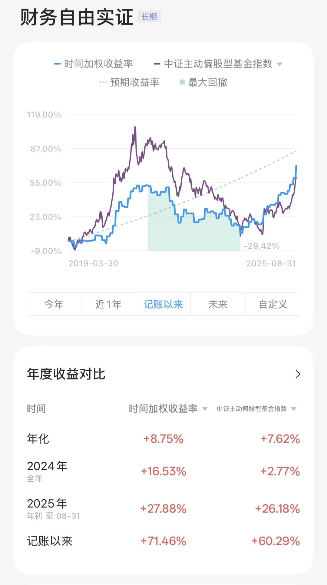

# 不像我｜财务自由实证 #77

**发布时间**: 2025-09-01 07:30:00

**原文链接**: [http://mp.weixin.qq.com/s?__biz=MzUzNjE3NzQ3Nw==&mid=2247494400&idx=1&sn=56e133971f9dcb21ed683c00ecac5e0f&chksm=faf8952acd8f1c3ca4bcd0ecd24ed71be256ecd4543f36c9a357c63b6ddd51f3aefdf8d7d6c2#rd](http://mp.weixin.qq.com/s?__biz=MzUzNjE3NzQ3Nw==&mid=2247494400&idx=1&sn=56e133971f9dcb21ed683c00ecac5e0f&chksm=faf8952acd8f1c3ca4bcd0ecd24ed71be256ecd4543f36c9a357c63b6ddd51f3aefdf8d7d6c2#rd)

---

[买车以后](https://mp.weixin.qq.com/s?__biz=MzUzNjE3NzQ3Nw==&mid=2247494384&idx=1&sn=86d0563c932ff14ae578b005f72e461d&scene=21#wechat_redirect)有读者问我，为啥这个决策很不符合对我“节俭”的印象?

在欧美不管是开（准）新车还是订阅制，都是个偏贵的选择。所以很多人买车首选都是二手，在德国二手车占到了每年买车交易的 68%。

买车时我考虑过这四种方案：

  1. 新车
  2. 车龄 1 年的准新车
  3. 车龄 5 年的二手车
  4. 车龄 10 年的二手车

一个一个说。

首先我排除了 10 年车龄的二手车，主要是不符合我买车的初衷。买车是为了改善全家出行体验，图便宜承担修车风险就有点本末倒置了。

比较合适我的买法，是准新车和 5 年左右的二手车：

  * 准新车车况和新车几乎没差，又能躲过了贬值最快的第一年；
  * 五年车车况不如新车但也不差，后续维修风险依然不高，贬值更慢。买五年车，开到 10 年左右卖掉，应该算是省钱和省心最平衡的买法了。

**折算成现金流** 我大致算了下，假设一辆车全新时售价 4 万欧：

  * 准新车开 5 年，每年贬值大约 2700 欧；
  * 五年车开 5 年，每年贬值大约 1500 欧；
  * 五年车保险更便宜些，但保养、年检项目更多，算是两两相抵。

所以准新车比五年二手车每月贵了 100 欧左右。

最后我选了订阅准新车，一是这 100 欧放到每个月 5、6 百的用车总成本里，就没有看起来那么多了。如果是放在每个月家庭预算里看，边际影响就更小了。**买不买车开销区别很大，但二手还是准新车，区别就没那么大了** 。

更重要的是对现在的我来说买二手车太耗心力了。每辆车车况、配置都不一样，从选车、到砍价、到提车、最后再卖掉，以我凡事都要研究清楚的性格，估计得花上百个小时。再把保养、维护算上，还能再翻一倍。

相比之下订阅制从订车到拿车还车，也就 2 个小时吧。拿车时距离下次保养还有 2 万公里，新车年检项目也少，用车期间这些时间也省了。对我来说，**多的钱买的其实不是车，而是心力** 。

### 省钱不是生活的目的

很多读者觉得我是个“节俭”的人。

但没人觉得自己活着就是为了省钱，而是会说「我省钱是为了____ 」。

我也是。我喜欢把账算清楚，知道每笔钱花到什么地方。这样能清楚自己在干什么，不是为了省下最后一个钢蹦。资源是有限的，在不在意的事上省一些，遇到在意的事才有余力多投入。

而且很多时候节俭只是个结果。

就像上篇文章和大伙说的，「生活中大多数问题，花钱通常不是最好的办法，只是最懒的」。找到更好的办法，钱就省下来了。

我想有个房子，然后发现如果不上班，低线城市更舒服，一线买房的钱就省下来了。我想房子住得舒服，然后发现住进去再慢慢改动，比一次性定下来更好，一大笔装修的钱就省下来了。我想吃得好、吃得健康，然后发现原来自己肉吃太多，碳水、蔬菜吃太少，买肉的钱就省下来了。

但生活里总有些我们在意的问题，是确实花钱能解决的。如果开销也在自己能力范围内，那此时就该花呀。赚钱、攒钱为的不就是这样的时刻。

（所谓「能力范围内」，我的理解是不影响更高的生活目标。比如我的生活目标是财务自由，那么实现以前就是不影响年度攒钱目标，现在则是被动收入可以负担）

* * *

### 实证账户更新 2025-08-31

记账工具来自[有知有行](http://mp.weixin.qq.com/s?__biz=MzUzNjE3NzQ3Nw==&mid=2247487794&idx=1&sn=b9db83140ef56b777315a5e415954736&chksm=fafb6f18cd8ce60eeebe855dcd793f173a5589e51657877fb9e8a2fff629eeb17688a40e2766&scene=21#wechat_redirect)

> 2025：实证终于完成本金目标，但体验上距离「可持续的收益」还差一些。所以从今年开始我会淡化本金数字，主要记录「收益率」和「收益比开支」，尤其是它们的可持续性，这是财务自由计划长期可行的基础。

收益比开支 👇 时隔多年，累计收益重回累计开支以上 🎉

> 注：这张图的思路来自[第 30 期实证](http://mp.weixin.qq.com/s?__biz=MzUzNjE3NzQ3Nw==&mid=2247489372&idx=1&sn=2118934ef05d930f50d2510ff6642cb1&chksm=fafb6976cd8ce06042f2bb8d1ed950a95262d11451fe116440e1ff84ca49c6fdae8a5d664a6d&scene=21#wechat_redirect)，长期跟踪财务自由的可行性。家庭开支曲线里，我没有算买房首付、一次性税费和部分硬装的钱。剩下大家能想到、想不到的，房贷月供、家具、家电、旅行、保险、医疗什么的，每一笔都算进去了。

……

最后例行提醒大伙，财务自由的投资和被动收入虽然看起来性感，但「因上努力，果上随缘」。本金和收益只是自由路上的「果」，**主业努力多赚钱、理性消费少挥霍，以此积累本金，再加上不被短期涨跌干扰、坚持投资才是背后的「因」** 。

投资复利只是我们获得被动收入的方式，而不是致富的秘密。

在财务自由实证的最初两年，我写得最多的也不是如何投资，而是如何**少在投资上花时间，好能多花时间关注主业** ，同时理性控制开销，尽快攒钱。

假如有 10 万本金，就算投资翻倍也才赚了 10 万。而投资翻倍极其困难，巴菲特的年化收益也才 20%。相比之下，在职场上努力提升，让收入再增加 10 万则要靠谱得多。

对财务自由而言，“钱生钱”做到 80 分足矣，剩下的精力还是应该关注赚钱和省钱这些“人生钱"。

### 关于这份实证

**普通人通过工资理财也能实现财务自由** ，这是这些年我一直在践行的理念。从最初懵懵懂懂到 2017 年制定具体的财务计划，再到今天，已经走了 5、6、7、 8 年。

为了能够更加透明、中立地实证普通人财务自由的可能性，从 2019 年开始我决定公开自己的财务进度，成为这个系列内容「财务自由实证」。

不追求大富大贵，但求能够不再纠结生计这些琐碎问题，在重大选择面前获得更多的人生选项，不再瞻前顾后。

有兴趣参考这个实证的朋友建议先看看之前的引导篇，[制定自己的财务自由计划](https://mp.weixin.qq.com/s?__biz=MzUzNjE3NzQ3Nw==&mid=2247484500&idx=1&sn=c04c3de1a1231bef25bb4cda773c00ff&scene=21#wechat_redirect)、[一起财务自由](https://mp.weixin.qq.com/s?__biz=MzUzNjE3NzQ3Nw==&mid=2247484480&idx=1&sn=258e8dd4976c7d3c324ed89b90904d14&scene=21#wechat_redirect)。以往的干货精华也都有汇总 👇

  * [全都安排好了，自由路上我们会遇到的每一个问题](http://mp.weixin.qq.com/s?__biz=MzUzNjE3NzQ3Nw==&mid=2247489926&idx=1&sn=eac357cebcbfd7250828cdda88d9f122&chksm=fafb67accd8ceebaa1e750f129714bb000be9720a990a70c6fba6fc52fd3712014a58d699d6e&scene=21#wechat_redirect)
  * [我的第一本书，整理财务自由方法论](https://mp.weixin.qq.com/s?__biz=MzUzNjE3NzQ3Nw==&mid=2247486809&idx=1&sn=8a80c493837ee044c5d55e0a423507d2&scene=21#wechat_redirect)
  * [一期访谈](http://mp.weixin.qq.com/s?__biz=MzUzNjE3NzQ3Nw==&mid=2247487473&idx=1&sn=10a891429291e78dea82b4df34e773f3&chksm=fafb71dbcd8cf8cdb15f114d6637bc6476a2803f9f0803dcbb4d91c1e68b5cc706c3dc55358b&scene=21#wechat_redirect)和[一期播客](http://mp.weixin.qq.com/s?__biz=MzUzNjE3NzQ3Nw==&mid=2247489401&idx=1&sn=a613497a5d6fdc3325d0424b9a78063e&chksm=fafb6953cd8ce045481121812b61b04f62dfe09a07b785991fc4cdd679bc9af13665d4c0ce62&scene=21#wechat_redirect)聊聊我的经历和观念

我给自己定下的目标是 30 岁前积累到**预计家庭年度开支的 10 倍** ，作为创造被动收入的本金（已经是过去式了。而且后来发现自由后开支不需要那么多，开销变少、本金被动变成了 20 倍）。依靠这些本金实现长期一定的投资收益就可以实现财务自由，不再依赖上班工资生活，有底气去选择自己真正想做的事儿。

财务自由路上一些重要节点：

  * 2017 年，计划正式开始，同年获得家人的认可和支持；
  * 2018 年，A 股熊市大跌，出现“钻石坑”机会；
  * 2019 年，开始财务自由公开实证（就是现在大家看到的这个系列）；
  * 2020 年，新冠股灾，自由之路上的又一个关键机会；
  * 2021 年，[自由目标基本达成](http://mp.weixin.qq.com/s?__biz=MzUzNjE3NzQ3Nw==&mid=2247489120&idx=1&sn=e5c5bf6d51914c212c228bc6f42346dc&chksm=fafb684acd8ce15c27cd508a67d57573f4acbeced75f805ef271b4efcf42cf54b363e5f93fcf&scene=21#wechat_redirect)，开始向新的节奏过渡；
  * 2022 年，遭遇自由后的第一次账户大幅回撤，但也是港股 6 年后、A 股 3.5 年后的又一次钻石坑，期待后续……
  * 也是同年，[我搬去二线生活了](https://mp.weixin.qq.com/s?__biz=MzUzNjE3NzQ3Nw==&mid=2247490915&idx=1&sn=313fba2e0a82a878f0188795ffe1900f&chksm=fafb6349cd8cea5fdfb9a63648453317d1970941f8c470f7bf697d07cca4054fca66f1dc5fac&scene=21#wechat_redirect)，[买房钱从计划中扣除](https://mp.weixin.qq.com/s?__biz=MzUzNjE3NzQ3Nw==&mid=2247490995&idx=1&sn=5b90cca481c8f33b2a7a19f6ef555791&scene=21#wechat_redirect)（自住房我会看作消费而不是资产）；
  * 2023 年，被市场教育，终于开始重视资产配置。[不要收益最大化，要痛苦最小化](https://mp.weixin.qq.com/s?__biz=MzUzNjE3NzQ3Nw==&mid=2247492697&idx=1&sn=f5be62d9593c8c448b94caeca498cad7&scene=21#wechat_redirect)；
  * 2024 年，第一次，本金目标达成；
  * 2025 年，行情来了……