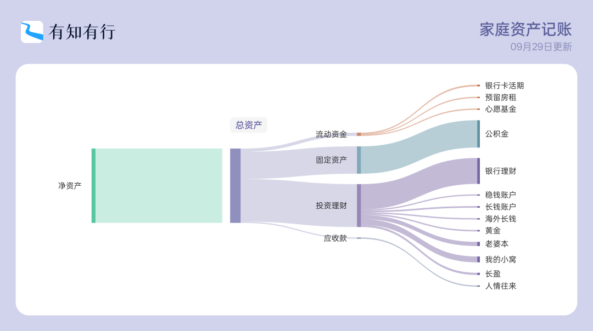

# 不开心

**发布时间**: 2025-10-13 07:30:00

**原文链接**: [http://mp.weixin.qq.com/s?__biz=MzUzNjE3NzQ3Nw==&mid=2247494513&idx=1&sn=62fdf9c2fa55d7b55f43fb010939b8ee&chksm=faf8955bcd8f1c4d1cb65bded62d2b20571eeedcd3a5551d72494380785522d5481ec30a0cb3#rd](http://mp.weixin.qq.com/s?__biz=MzUzNjE3NzQ3Nw==&mid=2247494513&idx=1&sn=62fdf9c2fa55d7b55f43fb010939b8ee&chksm=faf8955bcd8f1c4d1cb65bded62d2b20571eeedcd3a5551d72494380785522d5481ec30a0cb3#rd)

---

在有知有行看到一篇分享，我也有过很相似的经历。

按理说攒钱是为了让生活更好、更幸福。但分享的这位伙伴发现，自己攒下了更多钱，生活却没有如此，反而**因为攒钱多出了很多挣扎** 。直到后来盘点资产：

> 我这才意识到，自己已经攒了很多钱，也终于找到了匮乏感的原因：虽然攒下的钱越来越多，但我并没有提高消费预算，导致我自动驳回了很多消费需求，进而带给我一种「贫穷」的感觉。
> 
>

> 
> ——原帖链接：https://youzhiyouxing.cn/n/lite-posts/2469  
> 

问题出在积蓄增加的同时，没有同步增加预算。

类似经历我们家也有过不止一次。经常是生活或者环境变了，自己却没意识到。经历了一段时间温水煮青蛙，才突然发现怎么买东西越来越纠结

 摔桌子重新思考，如果发现确实无法再像以前一样，就增加预算。然后，果然就好了。

而且有意思的是，我们和这位伙伴一样——加了预算后不再过于小心翼翼、心态放松，纠结在买不买上的时间少了，脱离了心理上「贫穷」的感觉，最后实际开销并没有增长很多，但幸福感提升明显。

……

自由 = 资源 - 欲望

预算是个很好的工具，同时有管理欲望和增加资源的双倍好处。但有个关键步骤很容易被忽视，**攒下的钱，什么时候拿来用呢？**

如果有了更多积蓄却从来不用，甚至维持原来的预算、强迫自己不能用，那我们的可用资源实际上并没有增加。

越是会攒钱的伙伴，越容易陷入这个问题。我们总会先想办法来多攒钱、保持预算，反而不容易及时想到该加预算了。

所以后来我们家专门定了个加预算的计划，满足什么条件、加多少都提前考虑清楚，再就很少因此不开心了。

我们家现在是根据资产增长来加预算：比如我认为通过投资长期可以大约 10% 的年化收益。考虑到安全边际，每年变现 5% 很稳妥。那理论上，当年增加资产的至少 5%，就可以加到第二年的预算上（实际操作中还有其他细节考虑，感兴趣的伙伴可以看我[当时的分享](https://mp.weixin.qq.com/s?__biz=MzUzNjE3NzQ3Nw==&mid=2247493709&idx=1&sn=dd12e206b0ff31011c73d1ec6cbfd1d0&scene=21#wechat_redirect)）

每家情况不同，我的思路大家酌情参考。具体方法可能不那么重要，重要的是有意识关注，攒下的钱如何变成更好的生活，兼顾未来和当下的平衡。

……

随着这一路往前走，我发现自己对财务自由的理解也在慢慢变化。

1、开始认为财务自由就是有很多很多钱。

2、但后来发现很多人有财务、没自由，意识到我们想要的财务自由，重点不是财务而是时间。想要时间自由，其实并不需要很大一笔钱。通常被动收入能达到生活开销的一半以上，就能明显感受到这种变化（关注现金流，而非本金）。

3、现在，我认为是 注意力自由 > 时间自由 > 财务自由。

得知我当年开销比预算低了不少，大伙常会问我「那你明年是不是把预算再调低一点，这样就可以攒更快了」。我会说不，不仅如此，符合条件我会继续按计划加预算。

如果预算用不完就要减少，不就在惩罚勤劳节俭的自己。

预算不需要花完，花不完就是最好的。我希望每项预算，最后都能加到不用再经常考虑预算、也不会超支的程度。这样在花钱的问题上，我的注意力就更自由了。

> 哪怕你已经有了很多很多钱，但如果你每天都在关心这件事儿，你就依然不富有。

  * 财务自由：[我的财务自由实证之路](https://mp.weixin.qq.com/s?__biz=MzUzNjE3NzQ3Nw==&mid=2247494400&idx=1&sn=56e133971f9dcb21ed683c00ecac5e0f&scene=21#wechat_redirect)

  * 投资笔记：[十年之约](https://mp.weixin.qq.com/s?__biz=MzUzNjE3NzQ3Nw==&mid=2247494469&idx=1&sn=5d68f78943cf7ca9d3f724b26bcace5e&scene=21#wechat_redirect)[‍](https://mp.weixin.qq.com/s?__biz=MzUzNjE3NzQ3Nw==&mid=2247494469&idx=1&sn=5d68f78943cf7ca9d3f724b26bcace5e&scene=21#wechat_redirect)[‍](https://mp.weixin.qq.com/s?__biz=MzUzNjE3NzQ3Nw==&mid=2247494469&idx=1&sn=5d68f78943cf7ca9d3f724b26bcace5e&scene=21#wechat_redirect)[‍](https://mp.weixin.qq.com/s?__biz=MzUzNjE3NzQ3Nw==&mid=2247494469&idx=1&sn=5d68f78943cf7ca9d3f724b26bcace5e&scene=21#wechat_redirect)[‍](https://mp.weixin.qq.com/s?__biz=MzUzNjE3NzQ3Nw==&mid=2247494469&idx=1&sn=5d68f78943cf7ca9d3f724b26bcace5e&scene=21#wechat_redirect)[‍](https://mp.weixin.qq.com/s?__biz=MzUzNjE3NzQ3Nw==&mid=2247494469&idx=1&sn=5d68f78943cf7ca9d3f724b26bcace5e&scene=21#wechat_redirect)

  * 抵御风险：[9 月保险最推荐](https://mp.weixin.qq.com/s?__biz=MzUzNjE3NzQ3Nw==&mid=2247494454&idx=1&sn=44a285e7b873d261a9bb817817cb3680&scene=21#wechat_redirect)[‍](https://mp.weixin.qq.com/s?__biz=MzUzNjE3NzQ3Nw==&mid=2247494454&idx=1&sn=44a285e7b873d261a9bb817817cb3680&scene=21#wechat_redirect)[‍](https://mp.weixin.qq.com/s?__biz=MzUzNjE3NzQ3Nw==&mid=2247494454&idx=1&sn=44a285e7b873d261a9bb817817cb3680&scene=21#wechat_redirect)[‍](https://mp.weixin.qq.com/s?__biz=MzUzNjE3NzQ3Nw==&mid=2247494454&idx=1&sn=44a285e7b873d261a9bb817817cb3680&scene=21#wechat_redirect)[‍](https://mp.weixin.qq.com/s?__biz=MzUzNjE3NzQ3Nw==&mid=2247494454&idx=1&sn=44a285e7b873d261a9bb817817cb3680&scene=21#wechat_redirect)[‍](https://mp.weixin.qq.com/s?__biz=MzUzNjE3NzQ3Nw==&mid=2247494454&idx=1&sn=44a285e7b873d261a9bb817817cb3680&scene=21#wechat_redirect)[‍](https://mp.weixin.qq.com/s?__biz=MzUzNjE3NzQ3Nw==&mid=2247494454&idx=1&sn=44a285e7b873d261a9bb817817cb3680&scene=21#wechat_redirect)[‍](https://mp.weixin.qq.com/s?__biz=MzUzNjE3NzQ3Nw==&mid=2247494454&idx=1&sn=44a285e7b873d261a9bb817817cb3680&scene=21#wechat_redirect)[‍](https://mp.weixin.qq.com/s?__biz=MzUzNjE3NzQ3Nw==&mid=2247494454&idx=1&sn=44a285e7b873d261a9bb817817cb3680&scene=21#wechat_redirect)[‍](https://mp.weixin.qq.com/s?__biz=MzUzNjE3NzQ3Nw==&mid=2247494454&idx=1&sn=44a285e7b873d261a9bb817817cb3680&scene=21#wechat_redirect)[‍](https://mp.weixin.qq.com/s?__biz=MzUzNjE3NzQ3Nw==&mid=2247494454&idx=1&sn=44a285e7b873d261a9bb817817cb3680&scene=21#wechat_redirect)[‍](https://mp.weixin.qq.com/s?__biz=MzUzNjE3NzQ3Nw==&mid=2247494454&idx=1&sn=44a285e7b873d261a9bb817817cb3680&scene=21#wechat_redirect)[‍](https://mp.weixin.qq.com/s?__biz=MzUzNjE3NzQ3Nw==&mid=2247494454&idx=1&sn=44a285e7b873d261a9bb817817cb3680&scene=21#wechat_redirect)[‍](https://mp.weixin.qq.com/s?__biz=MzUzNjE3NzQ3Nw==&mid=2247494454&idx=1&sn=44a285e7b873d261a9bb817817cb3680&scene=21#wechat_redirect)[‍](https://mp.weixin.qq.com/s?__biz=MzUzNjE3NzQ3Nw==&mid=2247494454&idx=1&sn=44a285e7b873d261a9bb817817cb3680&scene=21#wechat_redirect)[‍](https://mp.weixin.qq.com/s?__biz=MzUzNjE3NzQ3Nw==&mid=2247494454&idx=1&sn=44a285e7b873d261a9bb817817cb3680&scene=21#wechat_redirect)[‍](https://mp.weixin.qq.com/s?__biz=MzUzNjE3NzQ3Nw==&mid=2247494454&idx=1&sn=44a285e7b873d261a9bb817817cb3680&scene=21#wechat_redirect)[‍](https://mp.weixin.qq.com/s?__biz=MzUzNjE3NzQ3Nw==&mid=2247494454&idx=1&sn=44a285e7b873d261a9bb817817cb3680&scene=21#wechat_redirect)[‍](https://mp.weixin.qq.com/s?__biz=MzUzNjE3NzQ3Nw==&mid=2247494454&idx=1&sn=44a285e7b873d261a9bb817817cb3680&scene=21#wechat_redirect)[‍](https://mp.weixin.qq.com/s?__biz=MzUzNjE3NzQ3Nw==&mid=2247494454&idx=1&sn=44a285e7b873d261a9bb817817cb3680&scene=21#wechat_redirect)[‍](https://mp.weixin.qq.com/s?__biz=MzUzNjE3NzQ3Nw==&mid=2247494454&idx=1&sn=44a285e7b873d261a9bb817817cb3680&scene=21#wechat_redirect)‍

  * 干货汇总：[财务自由路上应该了解的每一个问题](http://mp.weixin.qq.com/s?__biz=MzUzNjE3NzQ3Nw==&mid=2247489926&idx=1&sn=eac357cebcbfd7250828cdda88d9f122&chksm=fafb67accd8ceebaa1e750f129714bb000be9720a990a70c6fba6fc52fd3712014a58d699d6e&scene=21#wechat_redirect)