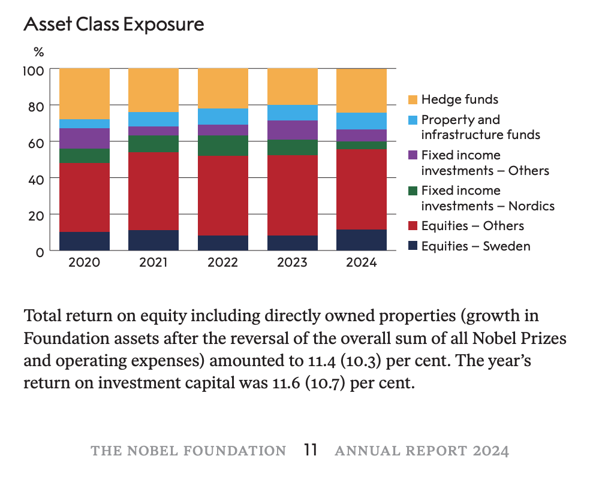
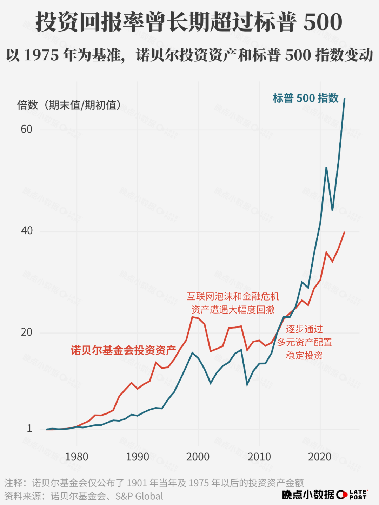

# 钱花不完

**发布时间**: 2025-10-20 07:30:00

**原文链接**: [http://mp.weixin.qq.com/s?__biz=MzUzNjE3NzQ3Nw==&mid=2247494527&idx=1&sn=61162aded94b4d9ec597c5cbd3296ad9&chksm=faf89555cd8f1c4317f994d4efa32a17590911cc9b0a569b62dad9aba7e7bdc041c9dcad45ed#rd](http://mp.weixin.qq.com/s?__biz=MzUzNjE3NzQ3Nw==&mid=2247494527&idx=1&sn=61162aded94b4d9ec597c5cbd3296ad9&chksm=faf89555cd8f1c4317f994d4efa32a17590911cc9b0a569b62dad9aba7e7bdc041c9dcad45ed#rd)

---

最近读到不少讲诺贝尔奖基金如何投资的文章。在发了 100 多年诺奖后，诺奖基金的本金不减反增到了原来的 3 倍（按通胀调整后的购买力，只看数字的话是 200 多倍）。

我一直觉得**这些基金会的投资方式最适合希望财务自由的伙伴们参考** ，胜过一般意义上的投资大师。之前也给大伙推荐过斯文森写的《机构投资的创新之路》 ，[管理耶鲁捐赠基金的经验](https://mp.weixin.qq.com/s?__biz=MzUzNjE3NzQ3Nw==&mid=2247492191&idx=1&sn=85fbc52c716c8e3ee08b2c389442646a&scene=21#wechat_redirect)。

怎么赚钱是一方面，怎么管钱、怎么花钱、怎么平衡当下和未来也很重要。

……

诺奖基金有段历史很有意思。

基金资产头 70 年，按照诺贝尔的遗嘱只能投资“安全”资产，比如市政债券、存款。后来一度陷入花光危机。

直到后来修改规则，可以投资股票、另类资产这些“有风险”的资产，长期才终于安全了。经过百年通胀后，诺奖的奖金和本金依然是笔巨款。

根据 2024 年的诺奖基金管理报告，诺奖有 56% 的资产配置在股票类资产上，还有 24% 的另类资产（对冲基金），存款、债券这样的“安全资产”占比只有 11% 了。

想到平时聊理财投资，大家常问「是否安全」。

但**是否安全，在不同期限下区别很大** 。存款、国债短期很安全，但如果看长期，尤其是有定期支取计划的，最安全的反而是短期有风险的股票类资产——不是把股票作为赌博的筹码，而是通过股票持有一家家上市公司，分享公司经营、社会发展带来的财富。

如果头 70 年诺奖不是只买“安全”，会比现在更安全。

那么我们想要的是长期的安全，还是短期的安全呢？想要财务自由长期可持续，资产配置还是应该以股票类资产为主。

……

说起不同期限下结论相反，普通人用工资慢慢积累本金、规划财务自由计划也是个例子。

看短期，得知一个计划要践行 10 年甚至更久，会觉得**这太慢了，有没有快一点的？**

但看长期，得知身边有人 40、50 岁被动收入可以超过工资，有底气提前退休了，又会羡慕这么「早」。

不同期限下，我们对快慢的感知也不同。短期的慢，有时会变成长期的快。所以有时候换个视角，跳到终点考虑问题可能会有启发。

常有读者问我，现在 XX 岁了，开始规划会不会太晚了。但代入终点想一下，其实哪怕 60 岁能实现“按时退休”，对烦恼的人来说也算是一种早了吧。

……

不过诺奖基金有一点普通人不适合学。之所以前 70 年错过股票类资产，最后还能翻身，「本金多、花得少」也是一个原因。

诺奖一年的奖金、管理所有开支加一起，才占到本金的 1.75%。但普通人想只靠每年只支取本金的 1.75% 过好生活，就要攒下年开支的 57 倍本金，恐怕到老也攒不到。

诺奖基金不是人，追求的是真永续。很可能 200、300 年后诺奖还是全球最有影响力的奖项，但我们早归尘土了。同样是追求「钱花不完」，我们的前提是在有限的生命中。

诺奖的优势是起步本金巨大，但我们也有个体的优势，诺奖不能一年发、一年停，但个人可以灵活调整生活方式。诺奖主要靠本金运营，我们还可以有其他收入。

所以我一直觉得，普通人没必要死磕一个绝对安全的提取比例，4%、5%、10% 都可以。重点是多准备几套不同的 Plan B，灵活应对。

退一步讲，**追求财富追求的其实不是钱，恰恰相反，我们追求的是可以不用再总考虑钱** 。实际上不需要让被动收入完全覆盖生活，只要能超过一半改善就很明显了，比如可以选择一份自己喜欢但收入不如现在的职业。

……

还有一点我很喜欢，诺奖这些年的收益，没有跑赢美股。

这张图来自 @晚点LatePost。虽然有点小瑕疵，因为诺奖资产会每年支取，资产变化不能完全反映投资收益。但好在不影响结论。

这些年总有一种论调，只有投资美股才能财务自由，其他市场不行。说起股市长期向上，美股也经常被看作特例，其他市场行不通。

诺奖基金的投资收益不是最高的，近十年也不及美股。但这不妨碍诺奖基金实现它的目标——提供足够有吸引力的奖金金额、保持全球最具影响力的奖项。

普通人追求财务自由也是。有没有比得上近十年收益最高的资产并不重要，重要的是在这个过程中我们有没有实现生活的目标、或者更近一步。没人总能押中收益最高的资产，但也没人比我们自己更了解自己的生活。

  * 财务自由：[我的财务自由实证之路](https://mp.weixin.qq.com/s?__biz=MzUzNjE3NzQ3Nw==&mid=2247494506&idx=1&sn=bbce43aa309c4f6cfa79d28955be71ca&scene=21#wechat_redirect)

  * 投资笔记：[十年之约](https://mp.weixin.qq.com/s?__biz=MzUzNjE3NzQ3Nw==&mid=2247494469&idx=1&sn=5d68f78943cf7ca9d3f724b26bcace5e&scene=21#wechat_redirect)[‍](https://mp.weixin.qq.com/s?__biz=MzUzNjE3NzQ3Nw==&mid=2247494469&idx=1&sn=5d68f78943cf7ca9d3f724b26bcace5e&scene=21#wechat_redirect)[‍](https://mp.weixin.qq.com/s?__biz=MzUzNjE3NzQ3Nw==&mid=2247494469&idx=1&sn=5d68f78943cf7ca9d3f724b26bcace5e&scene=21#wechat_redirect)[‍](https://mp.weixin.qq.com/s?__biz=MzUzNjE3NzQ3Nw==&mid=2247494469&idx=1&sn=5d68f78943cf7ca9d3f724b26bcace5e&scene=21#wechat_redirect)[‍](https://mp.weixin.qq.com/s?__biz=MzUzNjE3NzQ3Nw==&mid=2247494469&idx=1&sn=5d68f78943cf7ca9d3f724b26bcace5e&scene=21#wechat_redirect)[‍](https://mp.weixin.qq.com/s?__biz=MzUzNjE3NzQ3Nw==&mid=2247494469&idx=1&sn=5d68f78943cf7ca9d3f724b26bcace5e&scene=21#wechat_redirect)

  * 抵御风险：[9 月保险最推荐](https://mp.weixin.qq.com/s?__biz=MzUzNjE3NzQ3Nw==&mid=2247494454&idx=1&sn=44a285e7b873d261a9bb817817cb3680&scene=21#wechat_redirect)[‍](https://mp.weixin.qq.com/s?__biz=MzUzNjE3NzQ3Nw==&mid=2247494454&idx=1&sn=44a285e7b873d261a9bb817817cb3680&scene=21#wechat_redirect)[‍](https://mp.weixin.qq.com/s?__biz=MzUzNjE3NzQ3Nw==&mid=2247494454&idx=1&sn=44a285e7b873d261a9bb817817cb3680&scene=21#wechat_redirect)[‍](https://mp.weixin.qq.com/s?__biz=MzUzNjE3NzQ3Nw==&mid=2247494454&idx=1&sn=44a285e7b873d261a9bb817817cb3680&scene=21#wechat_redirect)[‍](https://mp.weixin.qq.com/s?__biz=MzUzNjE3NzQ3Nw==&mid=2247494454&idx=1&sn=44a285e7b873d261a9bb817817cb3680&scene=21#wechat_redirect)[‍](https://mp.weixin.qq.com/s?__biz=MzUzNjE3NzQ3Nw==&mid=2247494454&idx=1&sn=44a285e7b873d261a9bb817817cb3680&scene=21#wechat_redirect)[‍](https://mp.weixin.qq.com/s?__biz=MzUzNjE3NzQ3Nw==&mid=2247494454&idx=1&sn=44a285e7b873d261a9bb817817cb3680&scene=21#wechat_redirect)[‍](https://mp.weixin.qq.com/s?__biz=MzUzNjE3NzQ3Nw==&mid=2247494454&idx=1&sn=44a285e7b873d261a9bb817817cb3680&scene=21#wechat_redirect)[‍](https://mp.weixin.qq.com/s?__biz=MzUzNjE3NzQ3Nw==&mid=2247494454&idx=1&sn=44a285e7b873d261a9bb817817cb3680&scene=21#wechat_redirect)[‍](https://mp.weixin.qq.com/s?__biz=MzUzNjE3NzQ3Nw==&mid=2247494454&idx=1&sn=44a285e7b873d261a9bb817817cb3680&scene=21#wechat_redirect)[‍](https://mp.weixin.qq.com/s?__biz=MzUzNjE3NzQ3Nw==&mid=2247494454&idx=1&sn=44a285e7b873d261a9bb817817cb3680&scene=21#wechat_redirect)[‍](https://mp.weixin.qq.com/s?__biz=MzUzNjE3NzQ3Nw==&mid=2247494454&idx=1&sn=44a285e7b873d261a9bb817817cb3680&scene=21#wechat_redirect)[‍](https://mp.weixin.qq.com/s?__biz=MzUzNjE3NzQ3Nw==&mid=2247494454&idx=1&sn=44a285e7b873d261a9bb817817cb3680&scene=21#wechat_redirect)[‍](https://mp.weixin.qq.com/s?__biz=MzUzNjE3NzQ3Nw==&mid=2247494454&idx=1&sn=44a285e7b873d261a9bb817817cb3680&scene=21#wechat_redirect)[‍](https://mp.weixin.qq.com/s?__biz=MzUzNjE3NzQ3Nw==&mid=2247494454&idx=1&sn=44a285e7b873d261a9bb817817cb3680&scene=21#wechat_redirect)[‍](https://mp.weixin.qq.com/s?__biz=MzUzNjE3NzQ3Nw==&mid=2247494454&idx=1&sn=44a285e7b873d261a9bb817817cb3680&scene=21#wechat_redirect)[‍](https://mp.weixin.qq.com/s?__biz=MzUzNjE3NzQ3Nw==&mid=2247494454&idx=1&sn=44a285e7b873d261a9bb817817cb3680&scene=21#wechat_redirect)[‍](https://mp.weixin.qq.com/s?__biz=MzUzNjE3NzQ3Nw==&mid=2247494454&idx=1&sn=44a285e7b873d261a9bb817817cb3680&scene=21#wechat_redirect)[‍](https://mp.weixin.qq.com/s?__biz=MzUzNjE3NzQ3Nw==&mid=2247494454&idx=1&sn=44a285e7b873d261a9bb817817cb3680&scene=21#wechat_redirect)[‍](https://mp.weixin.qq.com/s?__biz=MzUzNjE3NzQ3Nw==&mid=2247494454&idx=1&sn=44a285e7b873d261a9bb817817cb3680&scene=21#wechat_redirect)[‍](https://mp.weixin.qq.com/s?__biz=MzUzNjE3NzQ3Nw==&mid=2247494454&idx=1&sn=44a285e7b873d261a9bb817817cb3680&scene=21#wechat_redirect)‍

  * 干货汇总：[财务自由路上应该了解的每一个问题](http://mp.weixin.qq.com/s?__biz=MzUzNjE3NzQ3Nw==&mid=2247489926&idx=1&sn=eac357cebcbfd7250828cdda88d9f122&chksm=fafb67accd8ceebaa1e750f129714bb000be9720a990a70c6fba6fc52fd3712014a58d699d6e&scene=21#wechat_redirect)