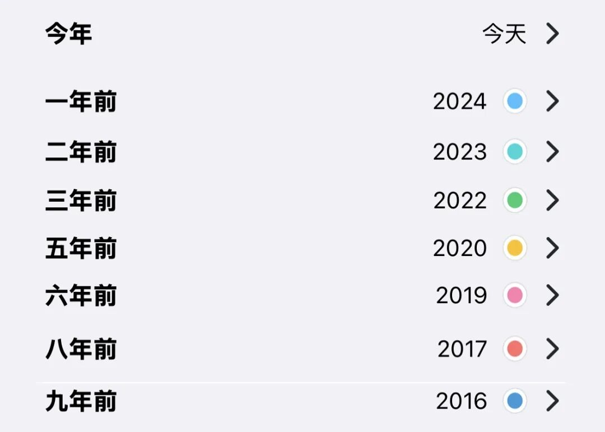

# 少年时该选鲜衣怒马，还是选钱？

**发布时间**: 2025-11-12 06:30:00

**原文链接**: [http://mp.weixin.qq.com/s?__biz=MzUzNjE3NzQ3Nw==&mid=2247494606&idx=1&sn=8ff324e64ff4e573a777ad6a266fd9a0&chksm=faf895e4cd8f1cf2e18e72ba27cea3803a9871cea244736b235cf85086ce116b48bd5d1031a3#rd](http://mp.weixin.qq.com/s?__biz=MzUzNjE3NzQ3Nw==&mid=2247494606&idx=1&sn=8ff324e64ff4e573a777ad6a266fd9a0&chksm=faf895e4cd8f1cf2e18e72ba27cea3803a9871cea244736b235cf85086ce116b48bd5d1031a3#rd)

---

老实说，今天这个话题有点笼统。通常我更喜欢具体的例子，比如选体验还是选攒钱，先说背景信息，什么体验、多少钱、年龄、家庭、生活阶段、生活目标等等等。

这也是为什么我经常觉得“道理”没用。因为它太精练了，遗失了前提条件——什么情况下该用什么道理，什么情况下不该用。

但，考虑这个问题用到的几个视角对我很有启发，也想给大家分享一下。

### 始终用自己富余的资源，交换自己稀缺的

不要反过来。

通常，年轻时我们更富余时间和体验，财富更稀缺。随着年龄增长，时间和体验才越来越稀缺。

[周一文章](https://mp.weixin.qq.com/s?__biz=MzUzNjE3NzQ3Nw==&mid=2247494597&idx=1&sn=b8c0caa279f3833705d574bbaf8c125b&scene=21#wechat_redirect)下大家点赞的留言「穷游富游终不如少年游」，虽然我不完全赞同这个比较，问自己是否愿意回到十年前，我是不愿的。但有一点我很同意，同样的穷游年轻时觉得快乐，年长可能就痛苦了，年轻的痛苦阈值更高、快乐阈值更低。

所以如果财富对自己更稀缺，合适的选项就不是鲜衣怒马少年时，而是反过来用体验和时间交换财富。

当时间和体验变得稀缺，再用前期积累的财富交换时间和体验。

### 先付费再享受，体验会更好

很多观点觉得体验要趁早，但心理学研究揭示了另一个事实——先付钱再享受，体验好过先享受再付钱。就像自助餐的快乐，就像还完房贷的一身轻。

我也是读到这个研究，再结合自己过往的经历，买东西爽一时、还分期苦一年，决定除非备好全款、再不分期买东西了。

所以体验的重点不在早晚，而是能否放下负担、全情投入。如果财力会成为体验的负担，先攒钱再无负担地享受，适度推迟反而可以增加人生的体验总和。

### 人不擅长预测自己未来的感受

平衡攒钱和消费时，大家经常会担心「有些事现在不做，以后就不是这个感觉了」。

但，其实我们极不擅长预测自己未来的感受。

我们会把今天不想做的事儿推到明天，觉得明天就会想做。暑假总会背一些书回家，觉得自己会读。办会员卡时总觉得自己会经常来。中学会觉得考上大学就解放了，大学觉得找到工作就解放了，工作觉得……

事实是，大部分事儿我们做完都会发现「不是这个感觉」。只是不同阶段大家的归因不同：

  * 年轻立刻做的，会归因到三分钟热度；
  * 年长再回头做，会感慨，哎，不是年轻的感觉了；

但有没有可能，年轻时做了也不是想象中的感觉呢？三分钟热度可比十年磨一剑普遍太多了。

所以如果一件事儿以前想做，长大后觉得不想了，我会挺开心的，多亏当时没做

 如果体验的价值之一是回忆复利，我刚好躲过了一个没复利的选择。

对了，我发现记日记，然后每年看「历史上的今天」，比某个具体的体验更能积累回忆红利 👇

### 痛苦最小化 > 体验最大化

我没读到过这个观点的心理学研究，但发现很符合自己过往的经历。

> 人对幸福的定义，不是得到了幸福的最大值，而是把痛苦的量缩到最小。 
> 
> ——叔本华

追求利益、幸福、体验最大化的过程，尤其是从 80 分到 100 分的阶段，常常会增加痛苦。

这也是我前天给大伙分享这个想法 👇 背后的哲学

> **花钱缓解痛苦 > 花钱改善日常体验 > 花钱尝鲜**。有痛苦先缓解痛苦，没有痛苦再去改善日常，日常都很好，再去试试尝鲜。

特别难做的决定、有点昂贵的消费，我就问自己不做现在是否痛苦，不痛苦就是不需要。

……

其实一笔钱该花还是该攒，人和人性格、经历不同，目标也不同，再加上未来难以预测，很难简单评价一句对错。

但上面这四个角度能我让更清楚自己在做什么，是被人性偏误牵着鼻子走、是人云亦云，还是真的考虑清楚了。希望它们也能帮到大家～

  * 财务自由：[我的财务自由实证之路](https://mp.weixin.qq.com/s?__biz=MzUzNjE3NzQ3Nw==&mid=2247494506&idx=1&sn=bbce43aa309c4f6cfa79d28955be71ca&scene=21#wechat_redirect)

  * 投资笔记：[十年之约](https://mp.weixin.qq.com/s?__biz=MzUzNjE3NzQ3Nw==&mid=2247494469&idx=1&sn=5d68f78943cf7ca9d3f724b26bcace5e&scene=21#wechat_redirect)[‍](https://mp.weixin.qq.com/s?__biz=MzUzNjE3NzQ3Nw==&mid=2247494469&idx=1&sn=5d68f78943cf7ca9d3f724b26bcace5e&scene=21#wechat_redirect)[‍](https://mp.weixin.qq.com/s?__biz=MzUzNjE3NzQ3Nw==&mid=2247494469&idx=1&sn=5d68f78943cf7ca9d3f724b26bcace5e&scene=21#wechat_redirect)[‍](https://mp.weixin.qq.com/s?__biz=MzUzNjE3NzQ3Nw==&mid=2247494469&idx=1&sn=5d68f78943cf7ca9d3f724b26bcace5e&scene=21#wechat_redirect)[‍](https://mp.weixin.qq.com/s?__biz=MzUzNjE3NzQ3Nw==&mid=2247494469&idx=1&sn=5d68f78943cf7ca9d3f724b26bcace5e&scene=21#wechat_redirect)[‍](https://mp.weixin.qq.com/s?__biz=MzUzNjE3NzQ3Nw==&mid=2247494469&idx=1&sn=5d68f78943cf7ca9d3f724b26bcace5e&scene=21#wechat_redirect)

  * 抵御风险：[10 月保险最推荐](https://mp.weixin.qq.com/s?__biz=MzUzNjE3NzQ3Nw==&mid=2247494454&idx=1&sn=44a285e7b873d261a9bb817817cb3680&scene=21#wechat_redirect)[‍](https://mp.weixin.qq.com/s?__biz=MzUzNjE3NzQ3Nw==&mid=2247494454&idx=1&sn=44a285e7b873d261a9bb817817cb3680&scene=21#wechat_redirect)[‍](https://mp.weixin.qq.com/s?__biz=MzUzNjE3NzQ3Nw==&mid=2247494454&idx=1&sn=44a285e7b873d261a9bb817817cb3680&scene=21#wechat_redirect)[‍](https://mp.weixin.qq.com/s?__biz=MzUzNjE3NzQ3Nw==&mid=2247494454&idx=1&sn=44a285e7b873d261a9bb817817cb3680&scene=21#wechat_redirect)[‍](https://mp.weixin.qq.com/s?__biz=MzUzNjE3NzQ3Nw==&mid=2247494454&idx=1&sn=44a285e7b873d261a9bb817817cb3680&scene=21#wechat_redirect)[‍](https://mp.weixin.qq.com/s?__biz=MzUzNjE3NzQ3Nw==&mid=2247494454&idx=1&sn=44a285e7b873d261a9bb817817cb3680&scene=21#wechat_redirect)[‍](https://mp.weixin.qq.com/s?__biz=MzUzNjE3NzQ3Nw==&mid=2247494454&idx=1&sn=44a285e7b873d261a9bb817817cb3680&scene=21#wechat_redirect)[‍](https://mp.weixin.qq.com/s?__biz=MzUzNjE3NzQ3Nw==&mid=2247494454&idx=1&sn=44a285e7b873d261a9bb817817cb3680&scene=21#wechat_redirect)[‍](https://mp.weixin.qq.com/s?__biz=MzUzNjE3NzQ3Nw==&mid=2247494454&idx=1&sn=44a285e7b873d261a9bb817817cb3680&scene=21#wechat_redirect)[‍](https://mp.weixin.qq.com/s?__biz=MzUzNjE3NzQ3Nw==&mid=2247494454&idx=1&sn=44a285e7b873d261a9bb817817cb3680&scene=21#wechat_redirect)[‍](https://mp.weixin.qq.com/s?__biz=MzUzNjE3NzQ3Nw==&mid=2247494454&idx=1&sn=44a285e7b873d261a9bb817817cb3680&scene=21#wechat_redirect)[‍](https://mp.weixin.qq.com/s?__biz=MzUzNjE3NzQ3Nw==&mid=2247494454&idx=1&sn=44a285e7b873d261a9bb817817cb3680&scene=21#wechat_redirect)[‍](https://mp.weixin.qq.com/s?__biz=MzUzNjE3NzQ3Nw==&mid=2247494454&idx=1&sn=44a285e7b873d261a9bb817817cb3680&scene=21#wechat_redirect)[‍](https://mp.weixin.qq.com/s?__biz=MzUzNjE3NzQ3Nw==&mid=2247494454&idx=1&sn=44a285e7b873d261a9bb817817cb3680&scene=21#wechat_redirect)[‍](https://mp.weixin.qq.com/s?__biz=MzUzNjE3NzQ3Nw==&mid=2247494454&idx=1&sn=44a285e7b873d261a9bb817817cb3680&scene=21#wechat_redirect)[‍](https://mp.weixin.qq.com/s?__biz=MzUzNjE3NzQ3Nw==&mid=2247494454&idx=1&sn=44a285e7b873d261a9bb817817cb3680&scene=21#wechat_redirect)[‍](https://mp.weixin.qq.com/s?__biz=MzUzNjE3NzQ3Nw==&mid=2247494454&idx=1&sn=44a285e7b873d261a9bb817817cb3680&scene=21#wechat_redirect)[‍](https://mp.weixin.qq.com/s?__biz=MzUzNjE3NzQ3Nw==&mid=2247494454&idx=1&sn=44a285e7b873d261a9bb817817cb3680&scene=21#wechat_redirect)[‍](https://mp.weixin.qq.com/s?__biz=MzUzNjE3NzQ3Nw==&mid=2247494454&idx=1&sn=44a285e7b873d261a9bb817817cb3680&scene=21#wechat_redirect)[‍](https://mp.weixin.qq.com/s?__biz=MzUzNjE3NzQ3Nw==&mid=2247494454&idx=1&sn=44a285e7b873d261a9bb817817cb3680&scene=21#wechat_redirect)[‍](https://mp.weixin.qq.com/s?__biz=MzUzNjE3NzQ3Nw==&mid=2247494454&idx=1&sn=44a285e7b873d261a9bb817817cb3680&scene=21#wechat_redirect)‍

  * 干货汇总：[财务自由路上应该了解的每一个问题](http://mp.weixin.qq.com/s?__biz=MzUzNjE3NzQ3Nw==&mid=2247489926&idx=1&sn=eac357cebcbfd7250828cdda88d9f122&chksm=fafb67accd8ceebaa1e750f129714bb000be9720a990a70c6fba6fc52fd3712014a58d699d6e&scene=21#wechat_redirect)