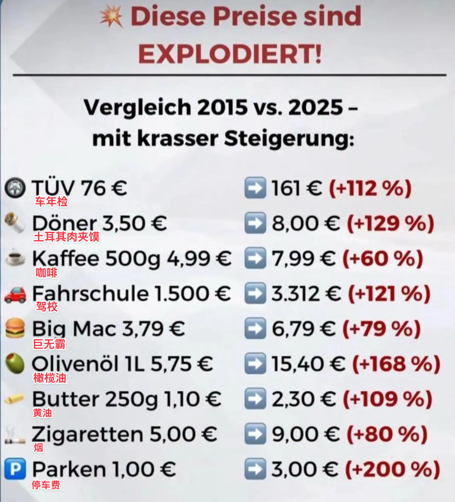
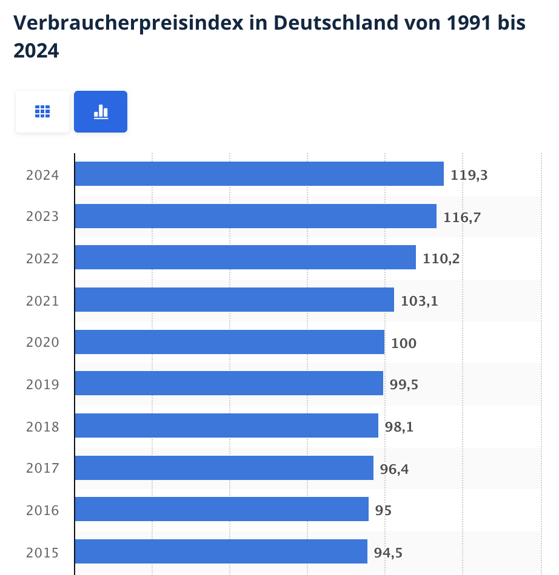
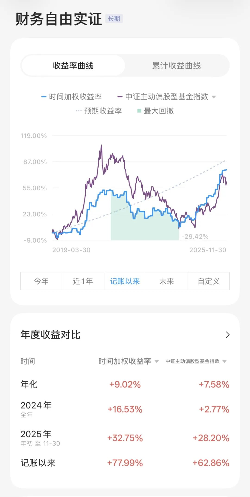

# 跟 10 年前比，开支涨了多少｜财务自由实证 #80

**发布时间**: 2025-12-01 06:30:00

**原文链接**: [http://mp.weixin.qq.com/s?__biz=MzUzNjE3NzQ3Nw==&mid=2247494663&idx=1&sn=f0d51c771fb6db779f01c56859a24a04&chksm=faf8922dcd8f1b3bd980d8f8076371d0a4211ae0572c2bbd8e34f666f4c4cd5b4f14f3b883d0#rd](http://mp.weixin.qq.com/s?__biz=MzUzNjE3NzQ3Nw==&mid=2247494663&idx=1&sn=f0d51c771fb6db779f01c56859a24a04&chksm=faf8922dcd8f1b3bd980d8f8076371d0a4211ae0572c2bbd8e34f666f4c4cd5b4f14f3b883d0#rd)

---

最近看到一张图，盘点德国近 10 年物价涨了多少 👇 标题是红字《这些价格涨疯了！》

我自己印象比较深的是咖啡豆。超市自营品牌以前折扣价能到 5 欧/kg，现在已经很难看到 10 欧以下了。

这么一想我也觉得物价涨疯了。但后来找了统计局的 CPI 数据 👇 物价指数相比 2015 年上涨 26%，相比 2020 年上涨 19%，涨幅远没这么夸张。

一看数据和感觉差别这么大，是不是数据有问题？

然后我又复盘了我们家的年度预算，2019 年我们家的预算是每月 2000 欧元，不算养车、养狗这些后来新加的项目，现在是 2300 欧，涨幅 15%。居然和统计数据差不多，而且吃和住都改善了。

财务自由计划刚出发时大家常担心，物价上涨怎么办？

有时候我们嘴上说的问题不一定是真问题。谈的是物价（环境），真关心的是（自己）钱够不够花。

但我发现一个很反差的细节。我们对米面涨价非常敏感，对自己的真实花销却很迟钝。一边米面涨价如数家珍，一边却对自己有多少钱、每年花多少存多少说不清楚。我也是，起初日常买东西感觉物价都涨疯了，买啥啥贵。但停下来盘点下实际开销，好像也还行？

想起乌俄冲突刚开始，面粉、菜籽油很快价格翻倍，我们感觉天都塌了。但后来一算开支短时间其实没啥变化，也是，一年能买几瓶油呢？如果实际花销心里没数，就容易把少数涨幅最大的开支当做全部。

对通胀的焦虑，我在想可能真正来源不是物价上涨，而是我们对自己实际花了多少钱感知太弱了。

又想起那句熟悉的话，别说预测未来了，我们连当下发生了什么都没搞清楚。如果担心未来物价上涨，可以先不用想那么远，先把过往的开支理清楚，了解当下才能筹备未来。

……

我对未来不太担心，可能也是一直在做类似的事。

一是数据告诉我，物价上涨没有感觉上那么夸张。我们容易一边焦虑米面油这些小钱涨价，一边又对车、家电这些越来越便宜的大件视而不见。如今“通胀没考虑房价”的焦虑也没了。

二是对未来的信心。

我大约是从 2016 年，读了《邻家的百万富翁》前后开始有制定年度预算的习惯。后来每一年，我们家基本都实现了预算目标（预算也会根据实际情况上下调整），预算做得越久，对管理开支也越有信心。

未来会发生什么、物价会怎么走我不知道，但我相信自己总能找到办法。管理开支和欲望也是一种能力，会随着训练不断成长。

有朋友觉得这样很麻烦，但我是这么想的：如果一份工作月赚 5000，我们愿意为此付出多少前期准备和持续投入。那不说多，能一个月省 500，总值得这份工作 1/10 的投入吧。

说起来，我发现大伙想开始一件事儿经常先问有没有什么好方法？

但我慢慢发现很多问题起步阶段方法一点也不重要，重要的是投入够不够。也太最近练腿，试了各种方法效果都不明显，直到最后加了重量。原来根本不是方法的问题，就是单纯量没够（瞎练除外，以不会受伤为前提哈）

后来我就换个角度考虑问题了，改问这件事儿的重要程度如何，然后问投入的量和重要程度是否匹配。量够了、时间够了，才会发现各种好方法。

* * *

### 实证账户更新 2025-11-30

记账工具来自[有知有行](http://mp.weixin.qq.com/s?__biz=MzUzNjE3NzQ3Nw==&mid=2247487794&idx=1&sn=b9db83140ef56b777315a5e415954736&chksm=fafb6f18cd8ce60eeebe855dcd793f173a5589e51657877fb9e8a2fff629eeb17688a40e2766&scene=21#wechat_redirect)

> 2025：实证终于完成本金目标，但体验上距离「可持续的收益」还差一些。所以从今年开始我会淡化本金数字，主要记录「收益率」和「收益比开支」，尤其是它们的可持续性，这是财务自由计划长期可行的基础。

收益比开支 👇 从 2025 年 6 月开始，累计被动收入（投资收益）重回累计开支以上 🎉

> 注：这张图的思路来自[第 30 期实证](http://mp.weixin.qq.com/s?__biz=MzUzNjE3NzQ3Nw==&mid=2247489372&idx=1&sn=2118934ef05d930f50d2510ff6642cb1&chksm=fafb6976cd8ce06042f2bb8d1ed950a95262d11451fe116440e1ff84ca49c6fdae8a5d664a6d&scene=21#wechat_redirect)，长期跟踪财务自由的可行性。家庭开支曲线里，我没有算买房首付、一次性税费和部分硬装的钱。剩下大家能想到、想不到的，房贷月供、家具、家电、旅行、保险、医疗什么的，每一笔都算进去了。

……

最后例行提醒大伙，财务自由的投资和被动收入虽然看起来性感，但「因上努力，果上随缘」。本金和收益只是自由路上的「果」，**主业努力多赚钱、理性消费少挥霍，以此积累本金，再加上不被短期涨跌干扰、坚持投资才是背后的「因」** 。

投资复利只是我们获得被动收入的方式，而不是致富的秘密。

在财务自由实证的最初两年，我写得最多的也不是如何投资，而是如何**少在投资上花时间，好能多花时间关注主业** ，同时理性控制开销，尽快攒钱。

假如有 10 万本金，就算投资翻倍也才赚了 10 万。而投资翻倍极其困难，巴菲特的年化收益也才 20%。相比之下，在职场上努力提升，让收入再增加 10 万则要靠谱得多。

对财务自由而言，“钱生钱”做到 80 分足矣，剩下的精力还是应该关注赚钱和省钱这些“人生钱"。

### 关于这份实证

**普通人通过工资理财也能实现财务自由** ，这是这些年我一直在践行的理念。从最初懵懵懂懂到 2017 年制定具体的财务计划，再到今天，已经走了 5、6、7、 8 年。

为了能够更加透明、中立地实证普通人财务自由的可能性，从 2019 年开始我决定公开自己的财务进度，成为这个系列内容「财务自由实证」。

不追求大富大贵，但求能够不再纠结生计这些琐碎问题，在重大选择面前获得更多的人生选项，不再瞻前顾后。

有兴趣参考这个实证的朋友建议先看看之前的引导篇，[制定自己的财务自由计划](https://mp.weixin.qq.com/s?__biz=MzUzNjE3NzQ3Nw==&mid=2247484500&idx=1&sn=c04c3de1a1231bef25bb4cda773c00ff&scene=21#wechat_redirect)、[一起财务自由](https://mp.weixin.qq.com/s?__biz=MzUzNjE3NzQ3Nw==&mid=2247484480&idx=1&sn=258e8dd4976c7d3c324ed89b90904d14&scene=21#wechat_redirect)。以往的干货精华也都有汇总 👇

  * [全都安排好了，自由路上我们会遇到的每一个问题](http://mp.weixin.qq.com/s?__biz=MzUzNjE3NzQ3Nw==&mid=2247489926&idx=1&sn=eac357cebcbfd7250828cdda88d9f122&chksm=fafb67accd8ceebaa1e750f129714bb000be9720a990a70c6fba6fc52fd3712014a58d699d6e&scene=21#wechat_redirect)
  * [我的第一本书，整理财务自由方法论](https://mp.weixin.qq.com/s?__biz=MzUzNjE3NzQ3Nw==&mid=2247486809&idx=1&sn=8a80c493837ee044c5d55e0a423507d2&scene=21#wechat_redirect)
  * [一期访谈](http://mp.weixin.qq.com/s?__biz=MzUzNjE3NzQ3Nw==&mid=2247487473&idx=1&sn=10a891429291e78dea82b4df34e773f3&chksm=fafb71dbcd8cf8cdb15f114d6637bc6476a2803f9f0803dcbb4d91c1e68b5cc706c3dc55358b&scene=21#wechat_redirect)和[一期播客](http://mp.weixin.qq.com/s?__biz=MzUzNjE3NzQ3Nw==&mid=2247489401&idx=1&sn=a613497a5d6fdc3325d0424b9a78063e&chksm=fafb6953cd8ce045481121812b61b04f62dfe09a07b785991fc4cdd679bc9af13665d4c0ce62&scene=21#wechat_redirect)聊聊我的经历和观念

我给自己定下的目标是 30 岁前积累到**预计家庭年度开支的 10 倍** ，作为创造被动收入的本金（已经是过去式了。而且后来发现自由后开支不需要那么多，开销变少、本金被动变成了 20 倍）。依靠这些本金实现长期一定的投资收益就可以实现财务自由，不再依赖上班工资生活，有底气去选择自己真正想做的事儿。

财务自由路上一些重要节点：

  * 2017 年，计划正式开始，同年获得家人的认可和支持；
  * 2018 年，A 股熊市大跌，出现“钻石坑”机会；
  * 2019 年，开始财务自由公开实证（就是现在大家看到的这个系列）；
  * 2020 年，新冠股灾，自由之路上的又一个关键机会；
  * 2021 年，[自由目标基本达成](http://mp.weixin.qq.com/s?__biz=MzUzNjE3NzQ3Nw==&mid=2247489120&idx=1&sn=e5c5bf6d51914c212c228bc6f42346dc&chksm=fafb684acd8ce15c27cd508a67d57573f4acbeced75f805ef271b4efcf42cf54b363e5f93fcf&scene=21#wechat_redirect)，开始向新的节奏过渡；
  * 2022 年，遭遇自由后的第一次账户大幅回撤，但也是港股 6 年后、A 股 3.5 年后的又一次钻石坑，期待后续……
  * 也是同年，[我搬去二线生活了](https://mp.weixin.qq.com/s?__biz=MzUzNjE3NzQ3Nw==&mid=2247490915&idx=1&sn=313fba2e0a82a878f0188795ffe1900f&chksm=fafb6349cd8cea5fdfb9a63648453317d1970941f8c470f7bf697d07cca4054fca66f1dc5fac&scene=21#wechat_redirect)，[买房钱从计划中扣除](https://mp.weixin.qq.com/s?__biz=MzUzNjE3NzQ3Nw==&mid=2247490995&idx=1&sn=5b90cca481c8f33b2a7a19f6ef555791&scene=21#wechat_redirect)（自住房我会看作消费而不是资产）；
  * 2023 年，被市场教育，终于开始重视资产配置。[不要收益最大化，要痛苦最小化](https://mp.weixin.qq.com/s?__biz=MzUzNjE3NzQ3Nw==&mid=2247492697&idx=1&sn=f5be62d9593c8c448b94caeca498cad7&scene=21#wechat_redirect)；
  * 2024 年，第一次，本金数字达成；
  * 2025 年，行情来了……