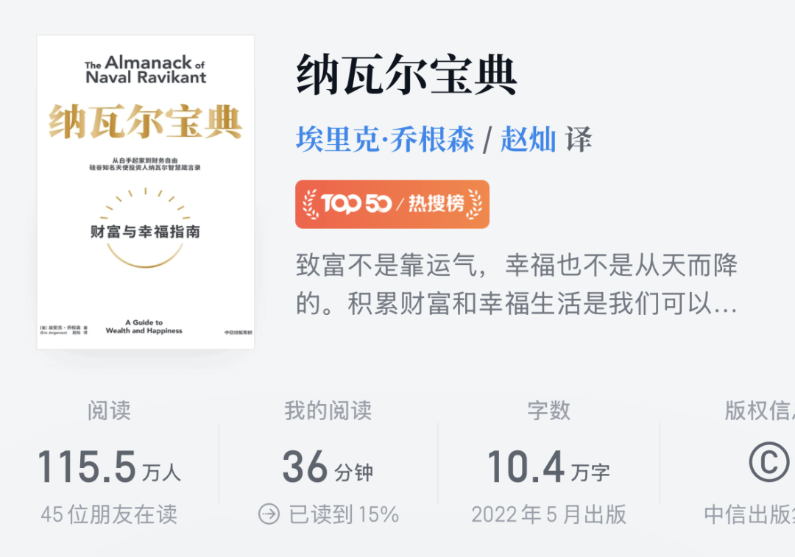
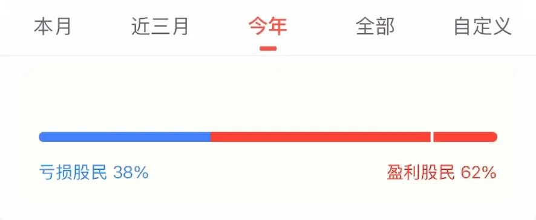

# “上班无法致富”

**发布时间**: 2025-12-11 06:30:00

**原文链接**: [http://mp.weixin.qq.com/s?__biz=MzUzNjE3NzQ3Nw==&mid=2247494693&idx=1&sn=588f09e500836c9dc17a299fe8e2068c&chksm=faf8920fcd8f1b19560e6f87b612b2f2e879cc1a18c85e8da49a42e1efb91fd9775776263c89#rd](http://mp.weixin.qq.com/s?__biz=MzUzNjE3NzQ3Nw==&mid=2247494693&idx=1&sn=588f09e500836c9dc17a299fe8e2068c&chksm=faf8920fcd8f1b19560e6f87b612b2f2e879cc1a18c85e8da49a42e1efb91fd9775776263c89#rd)

---

看到一条讨论，为什么中产家庭容易卡在当下这个财富阶段，**明明收入不错，但没有越忙越富，反而却越忙越累、越忙越焦虑** 。

虽然原帖结论过于简单粗暴（“因为钱都拿来买房了”），我不太认同。但好问题比好答案重要，这个问题帮我把很多财富思考串起来了。

经常有种说法，上班无法致富，得创业做生意才能赚大钱。但这种说法也不准确，很容易举出反例——上班年薪比别人创业收入还高的并不少，更别提还有那么多人创业失败。

但如果「致富」的定义不仅仅是收入高低，更代表时间和生活的掌控权。只靠上班确实很难，**因为上班的本质是出售时间，此时我们的时间是别人的** 。

所以《纳瓦尔宝典》才说，人无法只靠出售时间致富。

同理，哪怕是创业，如果生意离不开我也很难。

### 上班可以致富

只是不能只靠上班。

上班赚的、创业赚的、继承来的都是钱，除非收到假币。我觉得重点不是钱怎么来的，而是怎么用的。

容易卡在这个财富阶段，虽然我觉得原因不是买房这么简单粗暴，但可以联到一个更普适的理念上——**你是在购买资产，还是购买负债** 。

《穷爸爸富爸爸》是这么区分资产和负债的：

  * 负债是把钱从你口袋里拿走的；
  * 资产是把钱装进你口袋的，也就是钱生钱。

能钱生钱的，才是资产（财富）。

如果买一辆车，买车要花钱、使用要花钱、维护要花钱，就是一笔负债。但如果这辆车能帮你赚到更多，超过这辆车本身的成本，那就是一笔资产。

房子同理。虽然房子可能升值，但如果是自住房，我们大概率会一直停留在钱从口袋拿走的阶段，卖掉把钱放回口袋的概率极低。所以自住房大部分时候也是一笔负债。

容易卡在这个财富阶段，我觉得原因也在这——**世俗意义上代表「富」的东西，很多不是资产，而是负债** 。所以《金钱心理学》说，房子、车子、名包、名表很多都是财富的反义词，因为它们都是通过消灭财富获得的。

致富过程简化来说，就是不断购买积累资产。但如果赚到的钱最后都源源不断地变成负债，就走了相反的方向。

仔细区分资产和负债，我觉得这是《穷爸爸富爸爸》对生活最大的启发。

### 把钱变成资产

但很多人，包括我自己第一遍读完都有个质疑，上哪找能钱生钱的资产呢？我们经常想要购买资产，结果这笔资产不但没赚钱，还暴雷了。

像我自己预期的投资收益是[年化 x%](https://mp.weixin.qq.com/s?__biz=MzUzNjE3NzQ3Nw==&mid=2247494222&idx=1&sn=6c0e5c9837cc435f180407f0f21d186b&scene=21#wechat_redirect)，经常被问上哪找这样每年赚 x% 的投资呢？网上也经常有类似提问，攒了一笔钱，应该如何投资理财？

但我后来慢慢发现这个问题本身错了。**如果我们认同「投资就是认知变现」，那么正确的问题就不是哪有年化 x% 的投资，而是如何获得 x% 的认知** 。

除了房产，股票也是普通人容易接触到的资产之一。但没有相匹配的认知，赚钱的资产也可能亏钱。同花顺的数据，虽然今年行情不错、A 股整体涨了 20+%（以中证全指为参考），但依然有近四成投资者亏钱了 👇

今早刚听了一期播客，嘉宾是《买入银行股》的作者丁昶。里面有个观点：

> 投资是一件重要不紧急的事，但很多人把投资当成紧急不重要的事。

紧急：某某投资是你一生仅有的机会！vs 事实：机会常有，但本金不常有。

不重要：做到如下 123 点就能稳赚/配置某某资产就可以/来找我，我帮你赚钱 vs 事实：天下哪有这么多不劳而获的机会。

算算自己希望通过资产获得多少收益，如果这是一份工作的收入，这份工作需要多少学习和实践？那投资也要准备同等水平的付出。

不少投资亏钱，都是内心把投资 ≈ 不劳而获。或者花太多时间找投资，但花太少时间提升自己。最终只能获得和投入、认知水平相匹配的结果。

**普遍观念除了误解负债和资产的区别，也误解了资产致富的方式** 。积累资产能掌控时间，但不是说不用投入时间，而是另外两种方式：

  1. 时间弹性：管理资产就像一份 100% 弹性的工作，不要求出勤打卡、不要求公司坐班，也不要求你哪天上班、哪天放假，可以自由决定工作节奏。但也要为结果负责。
  2. 时间复利：出售时间的收入会手停口停，积累资产获得的收入，前期投入可能在未来 5 年、10 年甚至更久持续带来收入。只是后来的收获容易看到，前期的投入不容易看到。

但不管是弹性还是复利，终究是要投入的。

……

有个说法，智慧可以被学习，但无法被教授。我觉得投资也是，如果希望像培训班一样，上课知道 123 就能出成果，大概率会失望的。

《巴伦周刊》刊登过一个数据，统计了金融专业硕士的投资者、会计专业的投资和普通投资者的收益，结果发现金融专业只增加了 1% 的收益，会计专业好一点但也只增加 2% 的收益。

注意，这里说的不是百分点哈。如果普通投资者的收益是 3%，那金融专业的收益就是 3.03%，会计专业就是 3.06%。可以说几乎没区别。

所以**投资注定只能自己主动学习，无法等别人来教** 。

但有个前提我觉得是永恒不变的——想要获得什么，先想自己能付出什么。有两个最基本的变量，我们如何分配注意力和金钱，比如：

  * 能不能先把买负债的钱分一半出来。即便当下不知道买什么资产，也可以先存起来以后买；
  * 能不能把玩手机的时间分一半给投资理财的工具书和更系统有深度的内容。如果还不知道读什么，也可以先把这些时间用在找书上。

生活有相当一部分，是我们如何分配注意力和金钱的结果。

PS：像我这样性格比较 i、起步时身边也没有会投资的同事朋友，我的方法就是读书。

那时候参加线下读书会，发现别人分享的都是文学作品，就我分享的全是投资理财的工具书 😂 

聊到财务自由计划别人问去哪找赚钱的机会，我说书里都有！对方一脸不信。但现在我持有的资产和理念，几乎都是从读过的书里来的。书中有颜如玉，也太就是我[在图书馆追的](http://mp.weixin.qq.com/s?__biz=MzUzNjE3NzQ3Nw==&mid=2247487365&idx=1&sn=7ceba0a02ebcb2517275548bf1f9a1f4&chksm=fafb71afcd8cf8b94e6424fe6945ff41b3dcc9a586b28195c92719565380dc6874d549ac62e1&scene=21#wechat_redirect)，书中也真有我想要的黄金屋。

  * 财务自由：[我的财务自由实证之路](https://mp.weixin.qq.com/s?__biz=MzUzNjE3NzQ3Nw==&mid=2247494663&idx=1&sn=f0d51c771fb6db779f01c56859a24a04&scene=21#wechat_redirect)

  * 投资笔记：[十年之约](https://mp.weixin.qq.com/s?__biz=MzUzNjE3NzQ3Nw==&mid=2247494469&idx=1&sn=5d68f78943cf7ca9d3f724b26bcace5e&scene=21#wechat_redirect)[‍](https://mp.weixin.qq.com/s?__biz=MzUzNjE3NzQ3Nw==&mid=2247494469&idx=1&sn=5d68f78943cf7ca9d3f724b26bcace5e&scene=21#wechat_redirect)[‍](https://mp.weixin.qq.com/s?__biz=MzUzNjE3NzQ3Nw==&mid=2247494469&idx=1&sn=5d68f78943cf7ca9d3f724b26bcace5e&scene=21#wechat_redirect)[‍](https://mp.weixin.qq.com/s?__biz=MzUzNjE3NzQ3Nw==&mid=2247494469&idx=1&sn=5d68f78943cf7ca9d3f724b26bcace5e&scene=21#wechat_redirect)[‍](https://mp.weixin.qq.com/s?__biz=MzUzNjE3NzQ3Nw==&mid=2247494469&idx=1&sn=5d68f78943cf7ca9d3f724b26bcace5e&scene=21#wechat_redirect)[‍](https://mp.weixin.qq.com/s?__biz=MzUzNjE3NzQ3Nw==&mid=2247494469&idx=1&sn=5d68f78943cf7ca9d3f724b26bcace5e&scene=21#wechat_redirect)

  * 抵御风险：[11 月保险推荐](https://mp.weixin.qq.com/s?__biz=MzUzNjE3NzQ3Nw==&mid=2247494646&idx=1&sn=a09a9775baa8691d34fa21f3bd9ef03b&scene=21#wechat_redirect)[‍](https://mp.weixin.qq.com/s?__biz=MzUzNjE3NzQ3Nw==&mid=2247494646&idx=1&sn=a09a9775baa8691d34fa21f3bd9ef03b&scene=21#wechat_redirect)[‍](https://mp.weixin.qq.com/s?__biz=MzUzNjE3NzQ3Nw==&mid=2247494646&idx=1&sn=a09a9775baa8691d34fa21f3bd9ef03b&scene=21#wechat_redirect)[‍](https://mp.weixin.qq.com/s?__biz=MzUzNjE3NzQ3Nw==&mid=2247494646&idx=1&sn=a09a9775baa8691d34fa21f3bd9ef03b&scene=21#wechat_redirect)[‍](https://mp.weixin.qq.com/s?__biz=MzUzNjE3NzQ3Nw==&mid=2247494646&idx=1&sn=a09a9775baa8691d34fa21f3bd9ef03b&scene=21#wechat_redirect)[‍](https://mp.weixin.qq.com/s?__biz=MzUzNjE3NzQ3Nw==&mid=2247494646&idx=1&sn=a09a9775baa8691d34fa21f3bd9ef03b&scene=21#wechat_redirect)[‍](https://mp.weixin.qq.com/s?__biz=MzUzNjE3NzQ3Nw==&mid=2247494646&idx=1&sn=a09a9775baa8691d34fa21f3bd9ef03b&scene=21#wechat_redirect)[‍](https://mp.weixin.qq.com/s?__biz=MzUzNjE3NzQ3Nw==&mid=2247494646&idx=1&sn=a09a9775baa8691d34fa21f3bd9ef03b&scene=21#wechat_redirect)[‍](https://mp.weixin.qq.com/s?__biz=MzUzNjE3NzQ3Nw==&mid=2247494646&idx=1&sn=a09a9775baa8691d34fa21f3bd9ef03b&scene=21#wechat_redirect)[‍](https://mp.weixin.qq.com/s?__biz=MzUzNjE3NzQ3Nw==&mid=2247494646&idx=1&sn=a09a9775baa8691d34fa21f3bd9ef03b&scene=21#wechat_redirect)[‍](https://mp.weixin.qq.com/s?__biz=MzUzNjE3NzQ3Nw==&mid=2247494646&idx=1&sn=a09a9775baa8691d34fa21f3bd9ef03b&scene=21#wechat_redirect)[‍](https://mp.weixin.qq.com/s?__biz=MzUzNjE3NzQ3Nw==&mid=2247494646&idx=1&sn=a09a9775baa8691d34fa21f3bd9ef03b&scene=21#wechat_redirect)[‍](https://mp.weixin.qq.com/s?__biz=MzUzNjE3NzQ3Nw==&mid=2247494646&idx=1&sn=a09a9775baa8691d34fa21f3bd9ef03b&scene=21#wechat_redirect)[‍](https://mp.weixin.qq.com/s?__biz=MzUzNjE3NzQ3Nw==&mid=2247494646&idx=1&sn=a09a9775baa8691d34fa21f3bd9ef03b&scene=21#wechat_redirect)[‍](https://mp.weixin.qq.com/s?__biz=MzUzNjE3NzQ3Nw==&mid=2247494646&idx=1&sn=a09a9775baa8691d34fa21f3bd9ef03b&scene=21#wechat_redirect)[‍](https://mp.weixin.qq.com/s?__biz=MzUzNjE3NzQ3Nw==&mid=2247494646&idx=1&sn=a09a9775baa8691d34fa21f3bd9ef03b&scene=21#wechat_redirect)[‍](https://mp.weixin.qq.com/s?__biz=MzUzNjE3NzQ3Nw==&mid=2247494646&idx=1&sn=a09a9775baa8691d34fa21f3bd9ef03b&scene=21#wechat_redirect)[‍](https://mp.weixin.qq.com/s?__biz=MzUzNjE3NzQ3Nw==&mid=2247494646&idx=1&sn=a09a9775baa8691d34fa21f3bd9ef03b&scene=21#wechat_redirect)[‍](https://mp.weixin.qq.com/s?__biz=MzUzNjE3NzQ3Nw==&mid=2247494646&idx=1&sn=a09a9775baa8691d34fa21f3bd9ef03b&scene=21#wechat_redirect)[‍](https://mp.weixin.qq.com/s?__biz=MzUzNjE3NzQ3Nw==&mid=2247494646&idx=1&sn=a09a9775baa8691d34fa21f3bd9ef03b&scene=21#wechat_redirect)[‍](https://mp.weixin.qq.com/s?__biz=MzUzNjE3NzQ3Nw==&mid=2247494646&idx=1&sn=a09a9775baa8691d34fa21f3bd9ef03b&scene=21#wechat_redirect)‍

  * 干货汇总：[财务自由路上应该了解的每一个问题](http://mp.weixin.qq.com/s?__biz=MzUzNjE3NzQ3Nw==&mid=2247489926&idx=1&sn=eac357cebcbfd7250828cdda88d9f122&chksm=fafb67accd8ceebaa1e750f129714bb000be9720a990a70c6fba6fc52fd3712014a58d699d6e&scene=21#wechat_redirect)