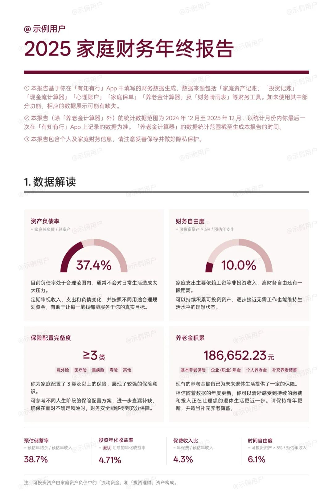
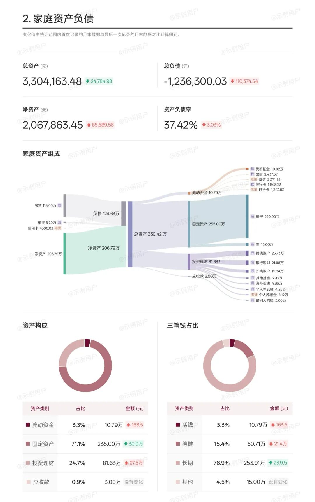
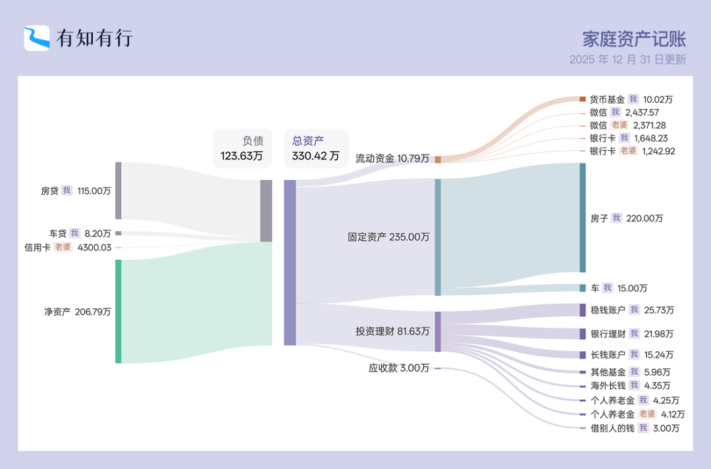
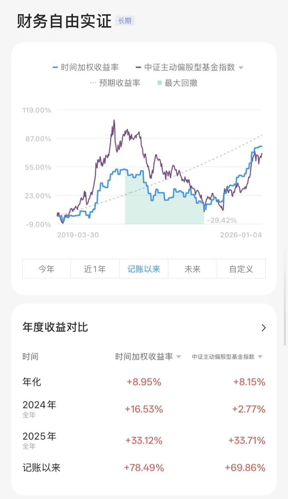
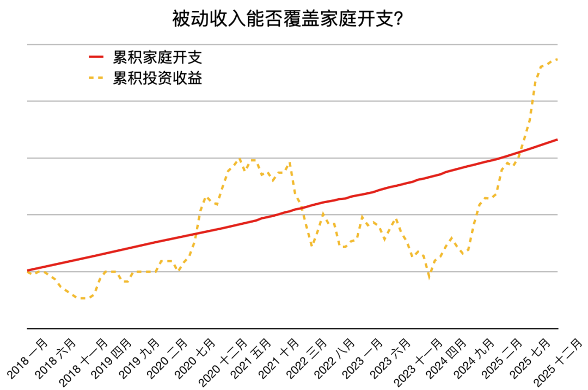

# 年终财务盘点｜财务自由实证 #81

**发布时间**: 2026-01-05 06:30:00

**原文链接**: [http://mp.weixin.qq.com/s?__biz=MzUzNjE3NzQ3Nw==&mid=2247494758&idx=1&sn=02940127529c0746c84b7fde4a2fd1d1&chksm=faf8924ccd8f1b5a4d6e73520b8a4a706d0f15c983aaa3b94430dc6c8c455cd9714da8e9ab1f#rd](http://mp.weixin.qq.com/s?__biz=MzUzNjE3NzQ3Nw==&mid=2247494758&idx=1&sn=02940127529c0746c84b7fde4a2fd1d1&chksm=faf8924ccd8f1b5a4d6e73520b8a4a706d0f15c983aaa3b94430dc6c8c455cd9714da8e9ab1f#rd)

---

新年快乐呀～

上篇文章给大伙推荐有知有行的《年终财务盘点指引手册》，我自己也从头到尾读了一遍，查缺补漏。年终盘点后拿到了 PDF 版的家庭财务年终报告 👇（这里用的是官方截图）

真心推荐大家都盘点看。

哪怕记账、写实证好多年，感觉对财务状况很清楚了，盘点完还是很有收获。我和也太坐在一起用大屏看 PDF，前后对比才发现和家人沟通财务状况、未来规划，比我原以为的更难。

按理说，我们家一直记账、写财务自由实证、日常沟通，我和也太对投资理财的预期应该差不多。但没想到我看完觉得符合预期的数字（甚至还微微超出一些），**也太看完有些失落——投资收益比她预想得少** 。

我觉得符合预期，是因为这些数字和我们规划、和财富规律基本一致：

1、我们预期的年化收益是 10%，从 19 年到现在的实际收益是 9%；

2、统计数据来看，社会财富七成来自“人生钱”，剩下三成才是“钱生钱”；

3、只靠投资很难暴富。投资对我们的意义是被动收入，有底气失去工作也能维持一定的生活水平。但仅靠投资很难让生活水平快速提高。想要提高财富的绝对量级，根本动力还是人，不是钱；

我说，这些我不是经常写嘛，你也每篇都看了。

她回答，以为我们可以更特殊一些。打破了投资暴富的幻想 😂

所以你们看，哪怕一起生活，随时分享沟通，预期还是会有很大偏差。这也是我觉得这次年终盘点最大的收获，有一份报告摆在眼前，两个人一起看具体数字，更容易发现这些偏差。

如果没有报告、没有具体数字，只靠语言沟通就难得多了。文字太模糊。

欢迎大伙也留言说说自己盘点完的收获～

有知有行的《指引手册》里有句话我也很喜欢：

> 

  
>   
> 很多朋友在生成桑基图后会好奇，我的家庭资产负债健康吗，应该怎么调整？
> 
> 其实，家庭财务是否健康没有统一的标准。人生阶段、资产负债的类型、风险承受能力、风险偏好、现金流不同，财务健康度的衡量标准也不同。
> 
> 当我们第一眼看到桑基图时，内心第一个想去改变的念头，可能就是很好的行动方向。

把数据摊开，摆在眼前，第一个念头可能就是行动方向。

* * *

### 实证账户更新 2025-12-31

记账工具来自[有知有行](http://mp.weixin.qq.com/s?__biz=MzUzNjE3NzQ3Nw==&mid=2247487794&idx=1&sn=b9db83140ef56b777315a5e415954736&chksm=fafb6f18cd8ce60eeebe855dcd793f173a5589e51657877fb9e8a2fff629eeb17688a40e2766&scene=21#wechat_redirect)

> 2025：实证终于完成本金目标，但体验上距离「可持续的收益」还差一些。所以从今年开始我会淡化本金数字，主要记录「收益率」和「收益比开支」，尤其是它们的可持续性，这是财务自由计划长期可行的基础。

收益比开支 👇 从 2025 年 6 月开始，累计被动收入（投资收益）重回累计开支以上 🎉

> 注：这张图的思路来自[第 30 期实证](http://mp.weixin.qq.com/s?__biz=MzUzNjE3NzQ3Nw==&mid=2247489372&idx=1&sn=2118934ef05d930f50d2510ff6642cb1&chksm=fafb6976cd8ce06042f2bb8d1ed950a95262d11451fe116440e1ff84ca49c6fdae8a5d664a6d&scene=21#wechat_redirect)，长期跟踪财务自由的可行性。家庭开支曲线里，我没有算买房首付、一次性税费和部分硬装的钱。剩下大家能想到、想不到的，房贷月供、家具、家电、旅行、保险、医疗什么的，每一笔都算进去了。

……

最后例行提醒大伙，财务自由的投资和被动收入虽然看起来性感，但「因上努力，果上随缘」。本金和收益只是自由路上的「果」，**主业努力多赚钱、理性消费少挥霍，以此积累本金，再加上不被短期涨跌干扰、坚持投资才是背后的「因」** 。

投资复利只是我们获得被动收入的方式，而不是致富的秘密。

在财务自由实证的最初两年，我写得最多的也不是如何投资，而是如何**少在投资上花时间，好能多花时间关注主业** ，同时理性控制开销，尽快攒钱。

假如有 10 万本金，就算投资翻倍也才赚了 10 万。而投资翻倍极其困难，巴菲特的年化收益也才 20%。相比之下，在职场上努力提升，让收入再增加 10 万则要靠谱得多。

对财务自由而言，“钱生钱”做到 80 分足矣，剩下的精力还是应该关注赚钱和省钱这些“人生钱"。

### 关于这份实证

**普通人通过工资理财也能实现财务自由** ，这是这些年我一直在践行的理念。从最初懵懵懂懂到 2017 年制定具体的财务计划，再到今天，已经走了 5、6、7、 8 年。

为了能够更加透明、中立地实证普通人财务自由的可能性，从 2019 年开始我决定公开自己的财务进度，成为这个系列内容「财务自由实证」。

不追求大富大贵，但求能够不再纠结生计这些琐碎问题，在重大选择面前获得更多的人生选项，不再瞻前顾后。

有兴趣参考这个实证的朋友建议先看看之前的引导篇，[制定自己的财务自由计划](https://mp.weixin.qq.com/s?__biz=MzUzNjE3NzQ3Nw==&mid=2247484500&idx=1&sn=c04c3de1a1231bef25bb4cda773c00ff&scene=21#wechat_redirect)、[一起财务自由](https://mp.weixin.qq.com/s?__biz=MzUzNjE3NzQ3Nw==&mid=2247484480&idx=1&sn=258e8dd4976c7d3c324ed89b90904d14&scene=21#wechat_redirect)。以往的干货精华也都有汇总 👇

  * [全都安排好了，自由路上我们会遇到的每一个问题](http://mp.weixin.qq.com/s?__biz=MzUzNjE3NzQ3Nw==&mid=2247489926&idx=1&sn=eac357cebcbfd7250828cdda88d9f122&chksm=fafb67accd8ceebaa1e750f129714bb000be9720a990a70c6fba6fc52fd3712014a58d699d6e&scene=21#wechat_redirect)
  * [我的第一本书，整理财务自由方法论](https://mp.weixin.qq.com/s?__biz=MzUzNjE3NzQ3Nw==&mid=2247486809&idx=1&sn=8a80c493837ee044c5d55e0a423507d2&scene=21#wechat_redirect)
  * [一期访谈](http://mp.weixin.qq.com/s?__biz=MzUzNjE3NzQ3Nw==&mid=2247487473&idx=1&sn=10a891429291e78dea82b4df34e773f3&chksm=fafb71dbcd8cf8cdb15f114d6637bc6476a2803f9f0803dcbb4d91c1e68b5cc706c3dc55358b&scene=21#wechat_redirect)和[一期播客](http://mp.weixin.qq.com/s?__biz=MzUzNjE3NzQ3Nw==&mid=2247489401&idx=1&sn=a613497a5d6fdc3325d0424b9a78063e&chksm=fafb6953cd8ce045481121812b61b04f62dfe09a07b785991fc4cdd679bc9af13665d4c0ce62&scene=21#wechat_redirect)聊聊我的经历和观念

我给自己定下的目标是 30 岁前积累到**预计家庭年度开支的 10 倍** ，作为创造被动收入的本金。依靠这些本金实现长期投资收益就可以实现财务自由，不再依赖上班工资生活，有底气去选择自己真正想做的事儿（目标已完成，后来发现自由后开支不需要那么多，开销变少、本金被动变成了 20 倍。记录还在继续，所以别再问我还没过 30 岁啦 😂 问就是 18）

财务自由路上一些重要节点：

  * 2017 年，计划正式开始，同年获得家人的认可和支持；
  * 2018 年，A 股熊市大跌，出现“钻石坑”机会；
  * 2019 年，开始财务自由公开实证（就是现在大家看到的这个系列）；
  * 2020 年，新冠股灾，自由之路上的又一个关键机会；
  * 2021 年，[自由目标基本达成](http://mp.weixin.qq.com/s?__biz=MzUzNjE3NzQ3Nw==&mid=2247489120&idx=1&sn=e5c5bf6d51914c212c228bc6f42346dc&chksm=fafb684acd8ce15c27cd508a67d57573f4acbeced75f805ef271b4efcf42cf54b363e5f93fcf&scene=21#wechat_redirect)，开始向新的节奏过渡；
  * 2022 年，遭遇自由后的第一次账户大幅回撤，但也是港股 6 年后、A 股 3.5 年后的又一次钻石坑，期待后续……
  * 也是同年，[我搬去二线生活了](https://mp.weixin.qq.com/s?__biz=MzUzNjE3NzQ3Nw==&mid=2247490915&idx=1&sn=313fba2e0a82a878f0188795ffe1900f&chksm=fafb6349cd8cea5fdfb9a63648453317d1970941f8c470f7bf697d07cca4054fca66f1dc5fac&scene=21#wechat_redirect)，[买房钱从计划中扣除](https://mp.weixin.qq.com/s?__biz=MzUzNjE3NzQ3Nw==&mid=2247490995&idx=1&sn=5b90cca481c8f33b2a7a19f6ef555791&scene=21#wechat_redirect)（自住房我会看作消费而不是资产）；
  * 2023 年，被市场教育，终于开始重视资产配置。[不要收益最大化，要痛苦最小化](https://mp.weixin.qq.com/s?__biz=MzUzNjE3NzQ3Nw==&mid=2247492697&idx=1&sn=f5be62d9593c8c448b94caeca498cad7&scene=21#wechat_redirect)；
  * 2024 年，第一次，本金数字达成；
  * 2025 年，行情来了……