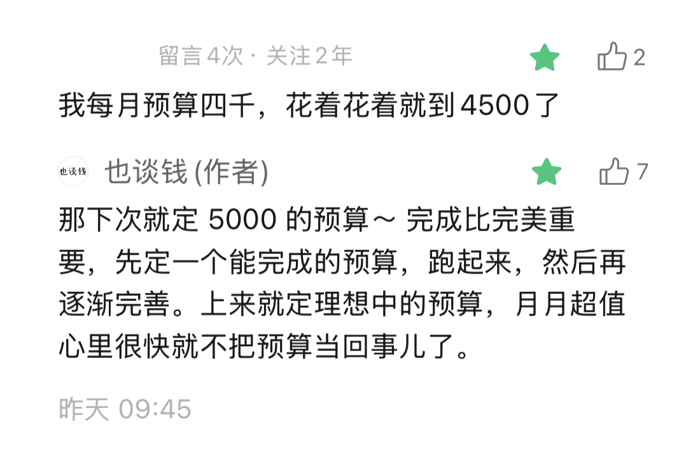

# 如何规划年度预算

**发布时间**: 2026-01-07 06:30:00

**原文链接**: [http://mp.weixin.qq.com/s?__biz=MzUzNjE3NzQ3Nw==&mid=2247494768&idx=1&sn=6a11b83ae49617a9535355570ae9abd1&chksm=faf8925acd8f1b4cacc3f2cfe7c0e466c272e1d9a804738d90eba092b3fcad154dbac3620735#rd](http://mp.weixin.qq.com/s?__biz=MzUzNjE3NzQ3Nw==&mid=2247494768&idx=1&sn=6a11b83ae49617a9535355570ae9abd1&chksm=faf8925acd8f1b4cacc3f2cfe7c0e466c272e1d9a804738d90eba092b3fcad154dbac3620735#rd)

---

又是考虑年度预算的时候了，我整理一篇关于预算的思考，希望对大家有帮助。

我自己开始做预算的起点：

  1. 记账了几年，但，好像钱也没少花？
  2. 在《邻家的百万富翁》里读到，很多受访家庭都有制定年度预算的习惯。

于是我也开始认真做预算，这个习惯就留下了。

有没有预算的感受对比：**只记账、没预算，就像开一辆没有速度表的车过区间测速** 。过了区间你会收到提醒，这段路是否超速。但知道超速时就已经晚了，钱已经花出去了。事后能知道自己花了多少钱，但及时干预的机会很少。

相比之下，有预算后每记一笔可以实时看到消费进度、时间进度，看着速度表就能更及时调整消费计划 👇 

截图来自 Moneywiz

也是因为这个感受，我不太用自动记账。手动记录虽然花时间，但对生活帮助更大。记账的目的不是获得账本，而是看到现实生活的改变。

这篇主要分两部分，如何划分预算，以及怎么定预算金额。

### 如何划分预算

有个容易踩的坑。我个人建议**不要按照开支类别划分预算** ，比如住房、交通、通信、餐饮、购物…这样。

复杂且没必要。除非你有明确的理由，否则交通费花 100、通信花 50，和交通费花 50、通信花 100 对生活是没区别的。

更好的角度是，怎么划分更有利于自己的财务目标。比如很多伙伴做预算的第一目标是攒钱，那其实只要把总开支控制在目标内，具体把钱花在哪没那么重要。或者有的伙伴做预算是为了给重要的事儿留出一笔钱，比如喜欢旅行，这样才值得专门给旅行开一个预算分类。

我们试下来**比较舒服的方式是按照责权划分** 。起初主要是三大块：

  1. 共同预算：吃饭、猫狗、房租水电、大件、旅行等共同开支都算这里；
  2. 我的预算：我自己想买的东西，各种只和我有关的开销，出差等等；
  3. 也太的预算：同上；

后来发现猫狗的预算不能和我们的餐饮放一起。赶上促销罐头囤多了，我俩吃饭钱就没有了 😂 所以后来又把共同预算细分成了 4 项：

最终我的结论，**每个成员都有自己的预算是最舒服、沟通成本最低的** 。只要每个成员都实现自己的目标，也就能实现总目标了。

同时我们也有内部统筹。比如猫狗预算意外超支了，我俩也会拿部分自己的预算贴补。旅行公共预算不够，也可以拿自己的预算补。逢年过节也可以把自己的部分预算转移给对方作礼物。

每个家庭情况可能不一样，但有个原则我觉得是一样的——不要按照开支分类划分预算，而是想如何划分能更小成本地实现财务目标。

### 如何定预算金额

这篇只说如何定家庭「总」预算金额哈，具体如何分配每个家庭情况都不一样。

我推荐三个思路，一个现实版的，两个理想状态。

1、现实版思路，刚开始做预算的伙伴推荐选这个

盘点全家去年的总开支（包括意外开支），然后加 5～10% 作为今年的预算。

一定要去「年」的总开支，不能是上个月的乘以 12。很多低频消费比如保险、旅游、大件置换，从年开支的角度才容易看到。

再次强调**计算去年开支时一定要把意外开支也算进去！** 记账十多年我发现个规律，意外开支其实可以预测。虽然每个月意外不重样，但对比每年，意外开支的总额反而差不多。

很多人预算超支都是太理想化了，没考虑人性和意外，定了个泯灭人性、绝不出错才能实现的预算。但我们不需要好看的预算，我们需要能用的。所以在去年总开支基础上再加 5～10%，预算的执行情况会好很多。

之前也专门聊过，其实预算定高一点反而容易省下钱：

> 有读者说自己预算 4000，但每个月总会超 500 👇
> 
> 
> 
> 我建议 ta 下次把预算设到 5000。**我知道不少这样的例子，预算上调后开销不升反降的** 。
> 
> 因为预算卡太低，花钱过程就会更挣扎和不爽，然后就会更想花钱“对自己好点”来抵消这种不爽。预期过高、体验就不好，更多精力会用来纠结「做不做」，留给做事儿本身的精力就更少了。
> 
> 预算高一些，预期低一些，目标更容易达成、过程体验也好了，这些内耗就消失了，因为痛苦产生的消费需求也会减少。
> 
> ——[降低预期](https://mp.weixin.qq.com/s?__biz=MzUzNjE3NzQ3Nw==&mid=2247494672&idx=1&sn=7f5d64ea526baebe6f22b7064a014935&scene=21#wechat_redirect)

过程越舒服，攒钱越容易。过程越痛苦，攒钱越难。

这个思路能比较轻松做到，再往下面两个理想状态上调整。

2、理想思路一

年度预算 = 年到手收入 - 今年希望存下的钱

这个思路把攒钱放在比花钱更高的优先级，有点类似工资到手先拿去投资，剩下的再花。

明确知道每年想存多少钱，有清晰的财务计划，比如买房、买车、财务自由、攒钱养老等等。根据 XX 岁要攒到多少钱就可以倒推出储蓄目标。这个思路能比较好兼顾当下和未来。

对了，有一类伙伴也许可以跳过现实版预算，直接到这一步——收入够花、大大咧咧的。不管卡里有多少钱都能花光，但少了其实也过得下去。这类伙伴可能连预算都不用，只要每次工资到手先把想存的钱转走就可以了。

3、理想思路二

年度预算 = 今年的预期被动收入

其实就是财务自由了。如果被动收入主要来自钱生钱，此时更重要的是如何打理投资、有序变现。感兴趣的伙伴可以参考这两篇：[如何通过投资获得稳定的现金流](https://mp.weixin.qq.com/s?__biz=MzUzNjE3NzQ3Nw==&mid=2247492671&idx=1&sn=333f7d55055dec260583fd6a7b3bc2de&scene=21#wechat_redirect)，[学习耶鲁基金规划年度开支](https://mp.weixin.qq.com/s?__biz=MzUzNjE3NzQ3Nw==&mid=2247493709&idx=1&sn=dd12e206b0ff31011c73d1ec6cbfd1d0&scene=21#wechat_redirect)。

PS：对了，如果大家想了解 Moneywiz 里设置预算的具体步骤和方法，可以到微信读书里找我之前写的书 👇

以上一些做预算的思考，希望对大家有帮助。

  * 财务自由：[我的财务自由实证之路](https://mp.weixin.qq.com/s?__biz=MzUzNjE3NzQ3Nw==&mid=2247494758&idx=1&sn=02940127529c0746c84b7fde4a2fd1d1&scene=21#wechat_redirect)

  * 投资笔记：[十年之约](https://mp.weixin.qq.com/s?__biz=MzUzNjE3NzQ3Nw==&mid=2247494748&idx=1&sn=dad388fa0eb698dffa2f253e96997ec1&scene=21#wechat_redirect)[‍](https://mp.weixin.qq.com/s?__biz=MzUzNjE3NzQ3Nw==&mid=2247494748&idx=1&sn=dad388fa0eb698dffa2f253e96997ec1&scene=21#wechat_redirect)[‍](https://mp.weixin.qq.com/s?__biz=MzUzNjE3NzQ3Nw==&mid=2247494748&idx=1&sn=dad388fa0eb698dffa2f253e96997ec1&scene=21#wechat_redirect)[‍](https://mp.weixin.qq.com/s?__biz=MzUzNjE3NzQ3Nw==&mid=2247494748&idx=1&sn=dad388fa0eb698dffa2f253e96997ec1&scene=21#wechat_redirect)[‍](https://mp.weixin.qq.com/s?__biz=MzUzNjE3NzQ3Nw==&mid=2247494748&idx=1&sn=dad388fa0eb698dffa2f253e96997ec1&scene=21#wechat_redirect)[‍](https://mp.weixin.qq.com/s?__biz=MzUzNjE3NzQ3Nw==&mid=2247494748&idx=1&sn=dad388fa0eb698dffa2f253e96997ec1&scene=21#wechat_redirect)

  * 抵御风险：[12 月保险推荐](https://mp.weixin.qq.com/s?__biz=MzUzNjE3NzQ3Nw==&mid=2247494740&idx=1&sn=6ec4a6741d2e2c502a6342a11dc1440c&scene=21#wechat_redirect)[‍](https://mp.weixin.qq.com/s?__biz=MzUzNjE3NzQ3Nw==&mid=2247494740&idx=1&sn=6ec4a6741d2e2c502a6342a11dc1440c&scene=21#wechat_redirect)[‍](https://mp.weixin.qq.com/s?__biz=MzUzNjE3NzQ3Nw==&mid=2247494740&idx=1&sn=6ec4a6741d2e2c502a6342a11dc1440c&scene=21#wechat_redirect)[‍](https://mp.weixin.qq.com/s?__biz=MzUzNjE3NzQ3Nw==&mid=2247494740&idx=1&sn=6ec4a6741d2e2c502a6342a11dc1440c&scene=21#wechat_redirect)[‍](https://mp.weixin.qq.com/s?__biz=MzUzNjE3NzQ3Nw==&mid=2247494740&idx=1&sn=6ec4a6741d2e2c502a6342a11dc1440c&scene=21#wechat_redirect)[‍](https://mp.weixin.qq.com/s?__biz=MzUzNjE3NzQ3Nw==&mid=2247494740&idx=1&sn=6ec4a6741d2e2c502a6342a11dc1440c&scene=21#wechat_redirect)[‍](https://mp.weixin.qq.com/s?__biz=MzUzNjE3NzQ3Nw==&mid=2247494740&idx=1&sn=6ec4a6741d2e2c502a6342a11dc1440c&scene=21#wechat_redirect)[‍](https://mp.weixin.qq.com/s?__biz=MzUzNjE3NzQ3Nw==&mid=2247494740&idx=1&sn=6ec4a6741d2e2c502a6342a11dc1440c&scene=21#wechat_redirect)[‍](https://mp.weixin.qq.com/s?__biz=MzUzNjE3NzQ3Nw==&mid=2247494740&idx=1&sn=6ec4a6741d2e2c502a6342a11dc1440c&scene=21#wechat_redirect)[‍](https://mp.weixin.qq.com/s?__biz=MzUzNjE3NzQ3Nw==&mid=2247494740&idx=1&sn=6ec4a6741d2e2c502a6342a11dc1440c&scene=21#wechat_redirect)[‍](https://mp.weixin.qq.com/s?__biz=MzUzNjE3NzQ3Nw==&mid=2247494740&idx=1&sn=6ec4a6741d2e2c502a6342a11dc1440c&scene=21#wechat_redirect)[‍](https://mp.weixin.qq.com/s?__biz=MzUzNjE3NzQ3Nw==&mid=2247494740&idx=1&sn=6ec4a6741d2e2c502a6342a11dc1440c&scene=21#wechat_redirect)[‍](https://mp.weixin.qq.com/s?__biz=MzUzNjE3NzQ3Nw==&mid=2247494740&idx=1&sn=6ec4a6741d2e2c502a6342a11dc1440c&scene=21#wechat_redirect)[‍](https://mp.weixin.qq.com/s?__biz=MzUzNjE3NzQ3Nw==&mid=2247494740&idx=1&sn=6ec4a6741d2e2c502a6342a11dc1440c&scene=21#wechat_redirect)[‍](https://mp.weixin.qq.com/s?__biz=MzUzNjE3NzQ3Nw==&mid=2247494740&idx=1&sn=6ec4a6741d2e2c502a6342a11dc1440c&scene=21#wechat_redirect)[‍](https://mp.weixin.qq.com/s?__biz=MzUzNjE3NzQ3Nw==&mid=2247494740&idx=1&sn=6ec4a6741d2e2c502a6342a11dc1440c&scene=21#wechat_redirect)[‍](https://mp.weixin.qq.com/s?__biz=MzUzNjE3NzQ3Nw==&mid=2247494740&idx=1&sn=6ec4a6741d2e2c502a6342a11dc1440c&scene=21#wechat_redirect)[‍](https://mp.weixin.qq.com/s?__biz=MzUzNjE3NzQ3Nw==&mid=2247494740&idx=1&sn=6ec4a6741d2e2c502a6342a11dc1440c&scene=21#wechat_redirect)[‍](https://mp.weixin.qq.com/s?__biz=MzUzNjE3NzQ3Nw==&mid=2247494740&idx=1&sn=6ec4a6741d2e2c502a6342a11dc1440c&scene=21#wechat_redirect)[‍](https://mp.weixin.qq.com/s?__biz=MzUzNjE3NzQ3Nw==&mid=2247494740&idx=1&sn=6ec4a6741d2e2c502a6342a11dc1440c&scene=21#wechat_redirect)[‍](https://mp.weixin.qq.com/s?__biz=MzUzNjE3NzQ3Nw==&mid=2247494740&idx=1&sn=6ec4a6741d2e2c502a6342a11dc1440c&scene=21#wechat_redirect)‍

  * 干货汇总：[财务自由路上应该了解的每一个问题](http://mp.weixin.qq.com/s?__biz=MzUzNjE3NzQ3Nw==&mid=2247489926&idx=1&sn=eac357cebcbfd7250828cdda88d9f122&chksm=fafb67accd8ceebaa1e750f129714bb000be9720a990a70c6fba6fc52fd3712014a58d699d6e&scene=21#wechat_redirect)

PPS：今天的题图想到一个段子，来自《金钱的艺术》

一个人注意到他的同事在喝拿铁，便问道：“你多久喝一次拿铁？”

“每天。”同事说。

“哇！在你 30 年的职业生涯中每天都喝！”那个人说，“那可是一大笔钱啊！每天一杯拿铁意味着你每年大约花费 1900 美元。如果你拿这笔钱投资，以 8% 的收益率计算，你将拥有 25 万美元，足够买一辆法拉利了。”

同事看起来很困惑。“你买拿铁吗？”她问道。

“不买。”

“那你的法拉利呢？”